CSE 6224 Software Requirements Engineering

TRIMESTER 2510

Campus Ride-Sharing Platform with Parking System Integration

**Software Requirements Specifications (SRS)**

**Tutorial Section: TT2L**

**Group D**

**Group Members:**

| William Sim Wee Lian | 243UC245RN |
|:--------------------:|:----------:|
|     Er Kangming      | 243UC247ND |
| Francis Wong Wei Hou | 243UC245PD |

Table of Contents

[Table of Contents [2](#_Toc201504682)](#_Toc201504682)

[1 SRS Overview [5](#_Toc201504683)](#_Toc201504683)

[1.1 Purpose [5](#_Toc201504684)](#_Toc201504684)

[1.2 Scope [5](#_Toc201504685)](#_Toc201504685)

[1.3 Product Overview [6](#_itj22jeox4nw)](#_itj22jeox4nw)

[1.3.1 Product Perspective [6](#_Toc201504687)](#_Toc201504687)

[1.3.1.1 Core Functionalities of the Campus Ride-Sharing and Parking
Integration System [7](#_4bplyqr3qak0)](#_4bplyqr3qak0)

[1.3.2 Product Functions [10](#_d3efecldkpdl)](#_d3efecldkpdl)

[1.3.2.1 Student Functions [10](#_fqw7falin480)](#_fqw7falin480)

[1.3.2.2 Staff Functions [10](#_rgd3d8gjhcuu)](#_rgd3d8gjhcuu)

[1.3.2.3 Guest Functions [11](#_k2r2lbd4hzl6)](#_k2r2lbd4hzl6)

[1.3.2.4 Admin Functions [11](#_7eacz7vs54s8)](#_7eacz7vs54s8)

[1.3.2.5 Special Functions [12](#_c6r1yrhx9b7v)](#_c6r1yrhx9b7v)

[1.3.3 User Characteristics [12](#_yxtck2rzx745)](#_yxtck2rzx745)

[1.3.4 Limitations [13](#_1dmqro6afeef)](#_1dmqro6afeef)

[1.4 Definitions [14](#_2pqq8ls36leq)](#_2pqq8ls36leq)

[2 Reference [16](#_971ayyj13c7m)](#_971ayyj13c7m)

[3 Requirements [17](#_axypde3vicq7)](#_axypde3vicq7)

[3.1 Functions [17](#_9vesubzhtuq2)](#_9vesubzhtuq2)

[3.1.1 Use case [17](#_Toc201504701)](#_Toc201504701)

[3.1.1.1 Student [18](#_wgt7p1owc0h4)](#_wgt7p1owc0h4)

[3.1.1.2 Staff [20](#_um15g0axcv7o)](#_um15g0axcv7o)

[3.1.1.3 Guest [22](#_2iwckjz7ek3o)](#_2iwckjz7ek3o)

[3.1.1.4 Admin [23](#_o1st2fsxauu6)](#_o1st2fsxauu6)

[3.1.2 Sequence Diagram [24](#_sg6k33co2rmc)](#_sg6k33co2rmc)

[3.1.2.1 Login and Logout with University Credentials (Student and
Staff） [24](#_Toc201504707)](#_Toc201504707)

[3.1.2.2 Guest Login/Logout(Guest) [26](#_Toc201504708)](#_Toc201504708)

[3.1.2.3 Create Ride Offer (Student and Staff)
[28](#_Toc201504709)](#_Toc201504709)

[3.1.2.4 Join Ride(Student and Staff）
[30](#_jhdd9315sbe2)](#_jhdd9315sbe2)

[3.1.2.5 View Recommended Matches and Routes(Student and Staff）
[31](#_Toc201504711)](#_Toc201504711)

[3.1.2.6 Manage Trip Schedule and History(Student and Staff）
[33](#_Toc201504712)](#_Toc201504712)

[3.1.2.7 Report Feature(Student and Staff）
[35](#_v5l6b1kzx7ej)](#_v5l6b1kzx7ej)

[3.1.2.8 View Real-time Parking Availability（Except Admin)
[37](#_Toc201504714)](#_Toc201504714)

[3.1.2.9 Reserve Parking Spot（Except Admin)
[39](#_Toc201504715)](#_Toc201504715)

[3.1.2.10 Check Parking Status （Except Admin)
[41](#_Toc201504716)](#_Toc201504716)

[3.1.2.11 Admin Login [43](#_Toc201504717)](#_Toc201504717)

[3.1.2.12 Access Carpooling Data & Review Reports and Complaints (Admin)
[45](#_Toc201504718)](#_Toc201504718)

[3.1.2.12 Access Carpooling Data (Admin)
[46](#_Toc201504719)](#_Toc201504719)

[3.1.2.14 Manage User Accounts (Admin)
[47](#_Toc201504720)](#_Toc201504720)

[3.1.2.15 Access Parking Data (Admin)
[49](#_Toc201504721)](#_Toc201504721)

[3.2 Performance Requirements [50](#_ychlqbjn7a49)](#_ychlqbjn7a49)

[3.3 Usability Requirements [51](#_38v2my7w6yux)](#_38v2my7w6yux)

[3.4 Interface Requirements [53](#_nkxyvxni1ba0)](#_nkxyvxni1ba0)

[3.4.1 System Interfaces [53](#_4n82y7w92mky)](#_4n82y7w92mky)

[3.4.2 User Interfaces [54](#_h82he0lwi22m)](#_h82he0lwi22m)

[3.4.3 Hardware Interfaces [55](#_cmr3rnp25pul)](#_cmr3rnp25pul)

[3.4.4 Software Interfaces [56](#_vuzplm1hr6vy)](#_vuzplm1hr6vy)

[3.4.5 Communications Interfaces [58](#_Toc201504729)](#_Toc201504729)

[3.5 Logical Database Requirements [59](#_Toc201504730)](#_Toc201504730)

[3.5.1 User [61](#_wsjs2pctggx6)](#_wsjs2pctggx6)

[3.5.2 Student [61](#_v1znsnyh39c0)](#_v1znsnyh39c0)

[3.5.3 Staff [62](#_v0pfyygzb3bm)](#_v0pfyygzb3bm)

[3.5.4 Guest [62](#_nkctxt4zhy5)](#_nkctxt4zhy5)

[3.5.5 Admin [62](#_pbjwneapuok1)](#_pbjwneapuok1)

[3.5.6 RideSharing [63](#_pqycq4h3jx23)](#_pqycq4h3jx23)

[3.5.7 Report [63](#_9ky39dlea927)](#_9ky39dlea927)

[3.5.8 ParkingSpot [64](#_5ru7jhr0j45a)](#_5ru7jhr0j45a)

[3.5.9 Reservation [64](#_ckrjlxolnrzd)](#_ckrjlxolnrzd)

[3.6 Design Constraints [65](#_b8viqdsiq4bu)](#_b8viqdsiq4bu)

[3.7 Software system attributes [67](#_fojvg3re68kb)](#_fojvg3re68kb)

[3.7.1 Accuracy [67](#_ph927qhejmkk)](#_ph927qhejmkk)

[3.7.2 Availability [67](#_521kougb59cn)](#_521kougb59cn)

[3.7.3 Maintainability [68](#_r9rpsxiy0hwm)](#_r9rpsxiy0hwm)

[3.7.4 Portability [68](#_71zygcsfd9b)](#_71zygcsfd9b)

[3.7.5 Reliability [69](#_1pibf85qq837)](#_1pibf85qq837)

[3.7.6 Security [69](#_Toc201504747)](#_Toc201504747)

[3.7.7 Usability [70](#_7kgkrzewsxxz)](#_7kgkrzewsxxz)

[3.8 Supporting Information [71](#_42e7xcjys0sj)](#_42e7xcjys0sj)

[3.8.1 Interview Summary [71](#_1suuq86s635b)](#_1suuq86s635b)

[3.8.2 Observation Summary [73](#_oyfthiyozwip)](#_oyfthiyozwip)

[4 Verification [87](#_urusr6d910ni)](#_urusr6d910ni)

[4.1 Verification Approach [87](#_54f2qogfo77o)](#_54f2qogfo77o)

[4.1.1 Functional Requirements Verification
[87](#_ocazcxwds0vw)](#_ocazcxwds0vw)

[4.1.2 Performance Requirements Verification
[87](#_c5h0jw3a66ts)](#_c5h0jw3a66ts)

[4.1.3 Security Requirements Verification
[88](#_fibf6ihexx75)](#_fibf6ihexx75)

[4.1.4 Usability Requirements Verification
[88](#_dvxh7w5pm25)](#_dvxh7w5pm25)

[4.1.5 Maintainability Requirements Verification
[89](#_u5xxh438rx4b)](#_u5xxh438rx4b)

[4.1.6 Portability Requirements Verification
[89](#_pnjwqa7bfvb4)](#_pnjwqa7bfvb4)

[4.2 Verification Criteria [90](#_4pf4n5hguzzv)](#_4pf4n5hguzzv)

[5 Appendices [92](#_rf4ns3n3xc7i)](#_rf4ns3n3xc7i)

[5.1 Assumptions and Dependencies [92](#_Toc201504762)](#_Toc201504762)

[5.2 Acronyms and Abbreviations [93](#_9gi8iotueh4u)](#_9gi8iotueh4u)

## 1 SRS Overview

### 1.1 Purpose

This project aims to develop a smart and secure Campus Ride-Sharing
Platform with Parking Integration to enhance mobility for students,
staff, and guests within the university. The platform integrates
ride-sharing with real-time parking availability and university
authentication to:

- Reduce traffic congestion

- Encourage eco-friendly commuting

- Maximize use of limited parking spaces

Serving as a unified digital platform, it enables users to coordinate
carpools, reserve parking spots, and enjoy a safer and more convenient
commuting experience.

### 1.2 Scope

The system is a web-based software solution designed to streamline
campus transportation and parking management. It allows users to:

- Coordinate ride-sharing trips (driver-passenger matching based on time
  and location)

- Track GPS locations in real time

- Reserve parking spots through a centralized interface

Authentication is enforced through university credentials, ensuring
role-based access. Guests can use limited features such as viewing rides
or booking parking.

Admins have access to a management dashboard for monitoring usage, user
activity, incident reports, and transportation analytics.

This project follows software requirements engineering principles and
incorporates user interviews and observations to accurately capture
stakeholder needs.

Out-of-scope features include:

- Integration with third-party ride-hailing or payment systems

- QR code scanning, license plate recognition, or physical parking
  sensors

- Mobile app development (web-only access)

This initiative supports the university’s digital transformation goals
by providing a scalable, data-driven solution for smarter campus
commuting.

### 1.3 Product Overview

#### 1.3.1 Product Perspective

This section provides an overview of the Campus Ride-Sharing and Parking
Integration System, a web-based platform developed to enhance
transportation coordination and parking efficiency within the
university. The system is part of a digital transformation initiative
aimed at improving campus mobility, optimizing parking resources, and
promoting sustainable travel practices.

The following architecture outlines the system’s major components and
their interactions.

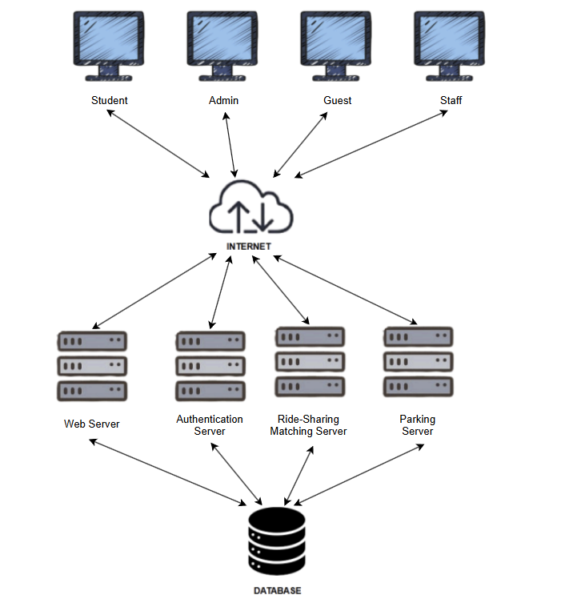

Figure 1.1: System Overview Diagram

The Campus Ride-Sharing and Parking Integration System functions as a
web-only extension of the university's digital services. It provides
real-time ride coordination, secure authentication through the
university’s Digital ID system, and integration with a data-driven
parking management module. By connecting students, staff, guests, and
administrators through a centralized interface, the platform supports
smarter transportation decisions and reduces congestion on campus.

Users access the system via a web browser, without the need for mobile
apps or physical sensor integration. Authentication is handled by the
university’s Digital ID authentication service, while guests use a
simplified login to access limited parking-related features.

##### 1.3.1.1 Core
Functionalities of the Campus Ride-Sharing and Parking Integration
System

**1.Ride Coordination**

- Create/join carpools with time and location matching

- Access trip history

**2.Authentication**

- Secure login via university credentials

- Limited guest access

**3.Parking Integration**

- Real-time parking availability

- Online reservations

**4.User Role Access**

- Students/Staff: Full access

- Guests: Parking-only access

- Admins: System oversight

**5.Safety & Reporting**

- In-ride reporting for incidents

- Activity logs for accountability

**6.Data & Analytics**

- Ride frequency, parking use, and behavior patterns

- Admin reports for planning and optimization

The following diagram illustrates the system's context diagram,
depicting the interactions between system components and external
actors.

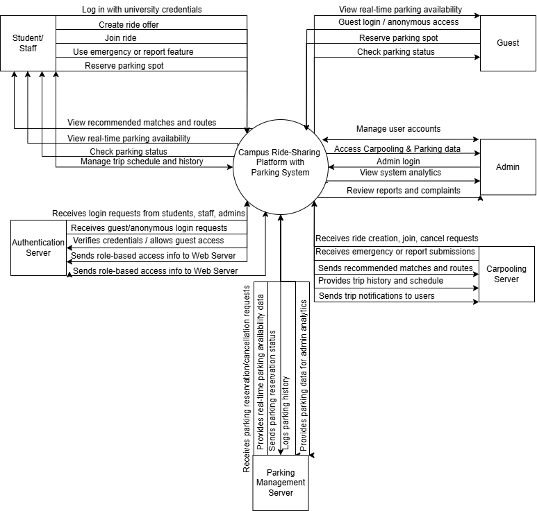

Figure 1.2: System Context Diagram

Aligned with the university's mission of embracing digital
transformation and promoting sustainable mobility, the Campus
Ride-Sharing and Parking Integration System is designed to fulfill a set
of key requirements tailored to the dynamic transportation needs of the
university community.

Table 1.1: Goals of the System

|  |  |
|----|----|
| Requirement ID | Goals |
| REQ_CRPS_001 | The system shall enable users to coordinate ride-sharing trips based on schedules, locations, and preferences. |
| REQ_CRPS_002 | The system shall provide a real-time display of available parking spots to assist users in making parking decisions. |
| REQ_CRPS_003 | The system shall allow users to reserve parking spots in advance to reduce search time and avoid congestion. |
| REQ_CRPS_004 | The system shall authenticate users through secure university credentials to ensure authorized access. |
| REQ_CRPS_005 | The system shall include GPS-based location tracking to improve matching accuracy and parking navigation. |
| REQ_CRPS_006 | The system shall provide a centralized web-based interface for ride-sharing and parking services. |
| REQ_CRPS_007 | The system shall support trip history tracking and real-time notifications for upcoming rides and changes. |
| REQ_CRPS_008 | The system shall provide reporting and contact features to enhance user safety during trips. |
| REQ_CRPS_009 | The system shall promote ride-sharing as a sustainable commuting alternative to reduce emissions and traffic. |
| REQ_CRPS_010 | The system shall include analytics dashboards for administrators to monitor usage and generate actionable insights. |

By addressing these requirements, the system aims to enhance campus
mobility, ensure secure and efficient commuting, and support data-driven
transportation management for students, staff, guests, and
administrators alike.

#### 1.3.2 Product Functions

This section outlines the normal and special operations performed by
different user roles (Students, Staff, Guests, and Admins) in the Campus
Ride-Sharing and Parking Integration System. The system supports
real-time data interaction, mobile accessibility, authentication
integration, and operational automation to ensure smooth and efficient
usage.

##### 1.3.2.1 Student Functions

1.  User Authentication (Login)

    - Students log in using university credentials via the
      Authentication Server.

    - Upon verification, access is granted to ride-sharing and smart
      parking modules.

2.  Create and Join Rides

    - Students can create ride offers with details (origin, destination,
      time).

    - They may join available rides shared by other users.

    - Notifications are sent upon successful ride creation or joining.

3.  View Recommended Routes

    - The system suggests optimal carpool routes based on location and
      time.

4.  Real-Time Parking

    - Students can view available parking spaces on campus in real time.

    - They may book parking slots in advance or on arrival.

5.  Reporting

    - Students can trigger report alerts during a ride, notifying admin
      and security.

6.  Trip and Booking History

    - A history of past rides, parking usage, and bookings is available
      for review.

##### 1.3.2.2 Staff Functions

1.  User Authentication (Login)

    - Staff log in using official university credentials.

2.  Ride and Parking Access

    - Same access to carpool and parking features as students.

    - May offer staff-only carpool groups or parking areas.

3.  Priority Parking Access

    - Staff may receive parking priority or reserved zones (configurable
      by admin).

4.  Reporting

    - Report features mirror student access, including real-time
      location sharing.

5.  Trip Logs

    - Staff can access their own travel and parking logs for commuting
      analysis.

##### 1.3.2.3 Guest Functions

1.  Guest Login

    - Guests access the system via guest or anonymous login with limited
      privileges.

2.  Smart Parking Access

    - Guests can view and book available parking spaces.

3.  Check Parking Status

    - Real-time updates on booking status and space availability are
      provided.

4.  No Ride-Sharing Access

    - Ride-sharing features are disabled for guest users for security
      and privacy.

##### 1.3.2.4 Admin Functions

1.  Admin Authentication

    - Admins securely log in via Authentication Server with elevated
      privileges.

2.  User Management

    - Admins can view, add, disable, or manage user roles (students,
      staff, guests).

3.  System Monitoring

    - Real-time dashboards for monitoring ride and parking usage
      statistics.

4.  Manage Complaints and Reports

    - Admins review complaints, reports, and take necessary actions.

5.  Route and Parking Optimization

    - Adjust routing algorithms and parking slot availability based on
      analytics.

6.  Analytics and Report Generation

    - The system supports generation of detailed reports:

    <!-- -->

    - User behavior trends

    - Ride utilization and efficiency

    - Parking occupancy rates

    - Report response logs

##### 1.3.2.5 Special Functions

1.  Centralized Authentication

    - All users authenticate through the centralized Authentication
      Server.

    - Login failures trigger retry mechanisms or error messages.

2.  Offline Data Handling

    - In case of network failure, ride and parking data are stored
      locally and synced upon reconnection.

3.  Data Backup and Recovery

    - System performs daily automated backups.

    - Recovery mechanisms restore system state in case of failures or
      data loss.

4.  Data Security and Logging

    - All transactions (rides, parking, report alerts) are logged for
      traceability and audit.

#### 1.3.3 User
Characteristics

This section describes the end users of the system, their expected
familiarity with its features, and how their level of knowledge may
impact the usage of the Campus Ride-Sharing and Parking Integration
System. The following table summarizes the expected level of knowledge
for each user role.

Table 1.2: User Characteristics

|  |  |  |
|----|----|----|
| Role | Description | Expected Knowledge |
| Student | Registered students of the university who use the platform for commuting and parking. | Familiar with mobile/web apps; basic understanding of ride-sharing and parking systems. |
| Staff | Faculty and administrative staff of the university who commute to campus. | Moderate understanding of the platform features; can use carpooling and parking tools. |
| Guest | Visitors or external individuals accessing campus with temporary parking needs. | Limited system knowledge; guided access to parking functions through a simplified UI. |
| Admin | System administrators who oversee operations, analytics, and user management. | High proficiency in backend management, user account handling, and data reporting tools. |

1.3.4 Limitations

The Campus Ride-Sharing and Parking Integration System faces several
limitations that may affect its performance, usability, and scalability.
These limitations stem from technical dependencies, real-time data
reliability, access restrictions, and adoption challenges. The key
limitations are as follows:

1.  **Dependency on Real-Time Data Accuracy**

> The effectiveness of the ride-sharing and smart parking features
> heavily relies on the accuracy and timeliness of real-time data (e.g.,
> GPS, parking availability). Any delays or inconsistencies in data
> feeds can negatively impact user experience and trust.

2.  **Integration Constraints with University Infrastructure**

> Integration with university authentication systems, campus maps, and
> databases may be subject to institutional access policies and
> technical limitations. Incompatibility or restricted access could
> hinder full functionality.

3.  **Limited Mobile Accessibility**

> The system is primarily web-based and does not currently support
> native mobile applications. This may reduce convenience for users who
> prefer mobile apps for on-the-go commuting and parking interactions.

4.  **User Adoption and Behavioral Change**

> The success of ride-sharing features depends on user willingness to
> share rides and coordinate with others. Cultural or personal
> preferences may limit adoption, requiring awareness campaigns and
> incentives.

5.  **Scalability for Multi-Campus Deployment**

> While designed for campus-wide use, scaling the system to additional
> campuses or institutions may require custom configurations, added
> infrastructure, and policy alignment, potentially increasing
> complexity and maintenance effort.

6.  **Privacy and Security Considerations**

> Handling sensitive user data such as location, vehicle, and trip
> history demands strict data protection measures. Ensuring privacy and
> security compliance with university policies and legal standards is
> critical but challenging.

1.4 Definitions

Below are terms, phrases and words used in the document and their
related definitions:

Table 1.3: Definition

|  |  |
|----|----|
| Terms | Definition |
| Campus Ride-Sharing and Parking Integration System | A web-based platform that enables university students, staff, and guests to coordinate ride-sharing and smart parking activities on campus. |
| Carpooling | A transportation service where users can offer or join rides with others traveling along the same route. |
| Smart Parking | A system that allows users to view real-time parking availability, reserve parking spots, and check parking status on campus. |
| User | Any individual who interacts with the system, including students, staff, guests, and administrators. |
| Student | An end user enrolled at the university who uses the system to access ride-sharing and parking services. |
| Staff | University employees who can also access ride-sharing and parking services, similar to students. |
| Guest | External users who can access limited parking features through guest login. |
| Admin | A user with administrative rights to manage system users, review reports, and monitor usage analytics. |
| Authentication Server | An external service used to verify user credentials and manage secure access to the platform. |
| Real-Time Parking Data | Dynamic data that reflects the current availability of parking spots across campus. |
| Reporting Feature | A feature that allows users to report incidents or request assistance during carpooling activities. |
| System Dashboard | The interface used by administrators to view analytics, manage content, and respond to user issues. |

## 2 Reference

Alotaibi, E., & Perwej, Y. (2021). A Smart Parking System Using IoT and
Cloud-Based Services. *International Journal of Advanced Computer
Science and Applications (IJACSA), 12*(1), 402–409.
doi:10.14569/IJACSA.2021.0120152

Abusair, S., Khan, R. Z., & Mian, M. A. (2020). Smart Campus Mobility: A
Conceptual Model for Ride-Sharing and Parking Management. *2020 5th
International Conference on Computing, Communication and Security
(ICCCS)*, 1–6. doi:10.1109/ICCCS49678.2020.9277569

Raghunandan, N., & Kalaimani, R. (2018). Efficient Parking Management
System Using Cloud and IoT. *International Journal of Engineering &
Technology*, 7(2.33), 287–290. doi:10.14419/ijet.v7i2.33.14393

Li, C., & Zheng, S. (2022). Smart Transportation Systems for University
Campuses: Integrating Ride-Sharing and Parking Solutions. *IEEE Access,
10*, 114327–114339. doi:10.1109/ACCESS.2022.3212984

Wang, X., & Wang, S. (2019). Optimization of University Campus Parking
Based on Real-Time Data. *Journal of Urban Transport*, 25(4), 89–97.
doi:10.1007/s12469-019-00255-6

OpenAI. (2024). *Campus Ride-Sharing & Parking User Survey Form*.
Retrieved from  
https://docs.google.com/forms/d/e/1FAIpQLSeXYZ1234SampleCampusForm

## 3 Requirements

### 3.1 Functions

#### 3.1.1 Use case

This is the overall use case diagram that shows all use cases for all
actors.

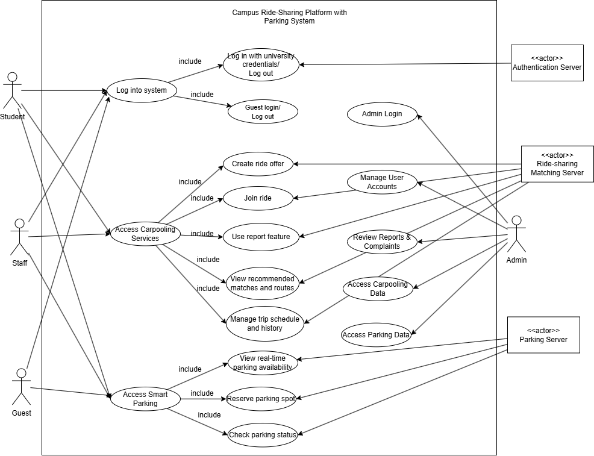

Figure 3.1: Use Case Diagram of Campus Ride-Sharing and Parking

Integration System

3.1.1.1 Student

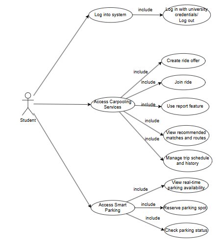

Figure 3.2: Use Case Diagram of Actor (Student)

Table 3.1: Use Case Diagram of Actor (Student)

|  |  |  |
|:---|:---|:---|
| Use Case ID | Use Case Name | Description |
| REQ_UCS001 | Login and Logout | Allows student to securely log in and out using university credentials |
| REQ_UCS002 | Create Ride Offer | Allows student to create a carpooling trip offer |
| REQ_UCS003 | Join Ride | Allows student to join available ride offers |
| REQ_UCS004 | View Recommended Routes | Shows best-matched carpooling routes based on preferences |
| REQ_UCS005 | Manage Trip Schedule and History | Enables student to view, edit, or cancel rides and view history |
| REQ_UCS006 | Report Feature | Allows student to send alerts or reports for security and complaints |
| REQ_UCS007 | View Real-time Parking | Displays available parking spots in real time |
| REQ_UCS008 | Reserve Parking Spot | Enables student to book parking space before arrival |
| REQ_UCS009 | Check Parking Status | Allows student to view parking reservation details |

##### 3.1.1.2 Staff

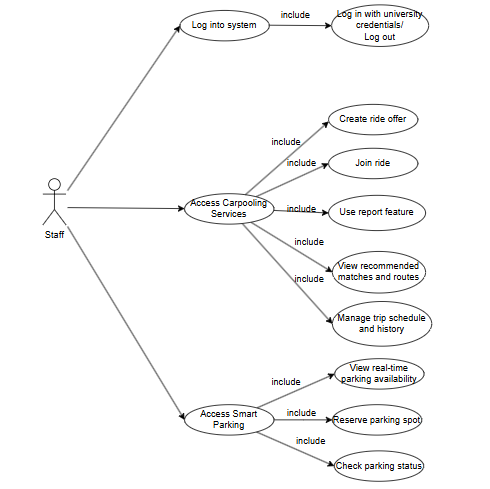

Figure 3.3: Use Case Diagram of Actor (Staff)

Table 3.2: Use Case Diagram of Actor (Staff)
|  |  |  |
|:---|:---|:---|
| Use Case ID | Use Case Name | Description |
| REQ_UCT001 | Login and Logout | Allows staff to securely log in and out using university credentials |
| REQ_UCT002 | Create Ride Offer | Allows staff to create a carpooling trip offer |
| REQ_UCT003 | Join Ride | Allows staff to join available ride offers |
| REQ_UCT004 | View Recommended Routes | Shows best-matched carpooling routes based on preferences |
| REQ_UCT005 | Manage Trip Schedule and History | Enables staff to view, edit, or cancel rides and view history |
| REQ_UCT006 | Report Feature | Allows staff to send alerts or reports for security and complaints |
| REQ_UCT007 | View Real-time Parking | Displays available parking spots in real time |
| REQ_UCT008 | Reserve Parking Spot | Enables staff to book parking space before arrival |
| REQ_UCT009 | Check Parking Status | Allows staff to view parking reservation details |

##### 3.1.1.3 Guest

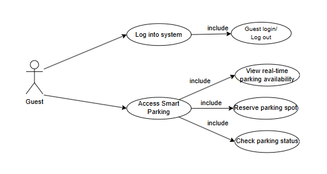

Figure 3.4: Use Case Diagram of Actor (Guest)

Table 3.3: Use Case Diagram of Actor (Guest)
|  |  |  |
|:---|:---|:---|
| Use Case ID | Use Case Name | Description |
| REQ_UCG001 | Guest Login/Log Out | Allows guest to log in or log out anonymously or with temporary credentials |
| REQ_UCG002 | View Real-time Parking | Allows guest to see current available parking spaces |
| REQ_UCG003 | Reserve Parking Spot | Enables guest to reserve parking space |
| REQ_UCG004 | Check Parking Status | Allows guest to check status of reserved parking |

##### 3.1.1.4 Admin

Figure 3.5: Use Case Diagram of Actor (Admin)

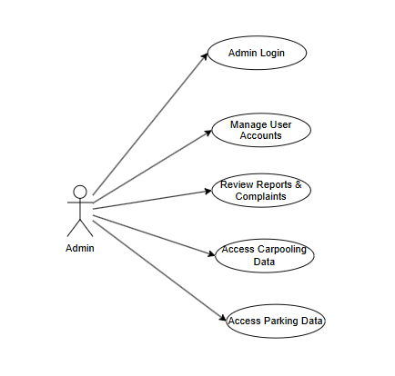

Table 3.4: Use Case Diagram of Actor (Admin)
|  |  |  |
|----|----|----|
| Use Case ID | Use Case Name | Description |
| REQ_UCA001 | Admin Login/Log out | Allows admin to securely log in or log out to the system |
| REQ_UCA002 | Manage User Accounts | Enables admin to create, edit, or delete user accounts |
| REQ_UCA003 | Review Reports & Complaints | Admin reviews submitted complaints |
| REQ_UCA004 | Access Carpooling Data | Admin views and manages carpooling-related records |
| REQ_UCA005 | Access Parking Data | Admin views and manages parking-related records |

3.1.2 Sequence Diagram

##### 3.1.2.1 Login and Logout
with University Credentials (Student and Staff）

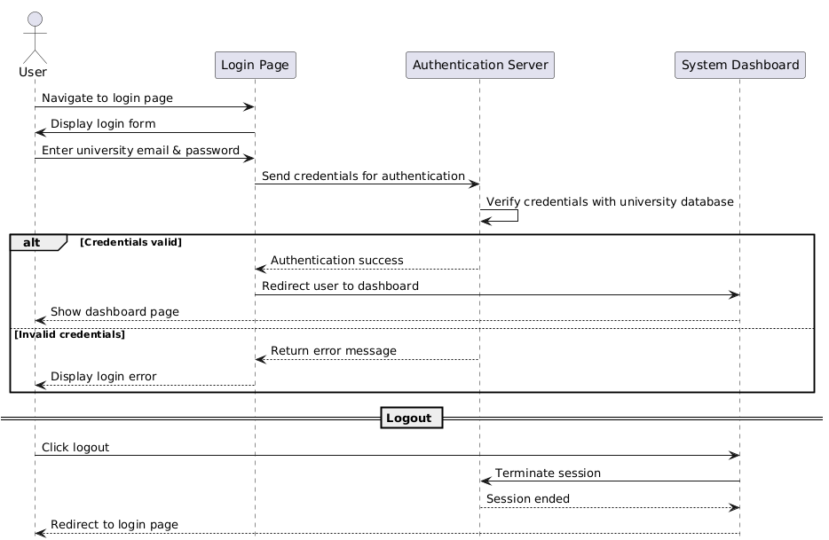

Figure 3.6：Login and Logout with University Credentials

Table 3.5 : Login and Logout with University Credentials
<table>
<colgroup>
<col style="width: 26%" />
<col style="width: 73%" />
</colgroup>
<tbody>
<tr>
<td>Field</td>
<td>Description</td>
</tr>
<tr>
<td>ID</td>
<td>REQSQ001</td>
</tr>
<tr>
<td>Feature</td>
<td>Login and Logout with University Credentials</td>
</tr>
<tr>
<td>Version</td>
<td>1.0</td>
</tr>
<tr>
<td>Purpose</td>
<td>To allow students, staff, and admins to securely access the
system</td>
</tr>
<tr>
<td>Actor</td>
<td>Student / Staff</td>
</tr>
<tr>
<td>Precondition</td>
<td>User must have valid university credentials</td>
</tr>
<tr>
<td>Postcondition</td>
<td>User is authenticated and redirected to the system dashboard</td>
</tr>
<tr>
<td>Main Flow</td>
<td>
1. User navigates to login page

2. System displays login form

3. User submits credentials

4. System authenticates credentials

5. On success, user is redirected to dashboard
</td>
</tr>
<tr>
<td>Alternate Scenario</td>
<td>
1. If credentials are invalid, system displays an error

2. If fields are empty, system prompts for required input
</td>
</tr>
</tbody>
</table>

##### 3.1.2.2 Guest
Login/Logout(Guest)

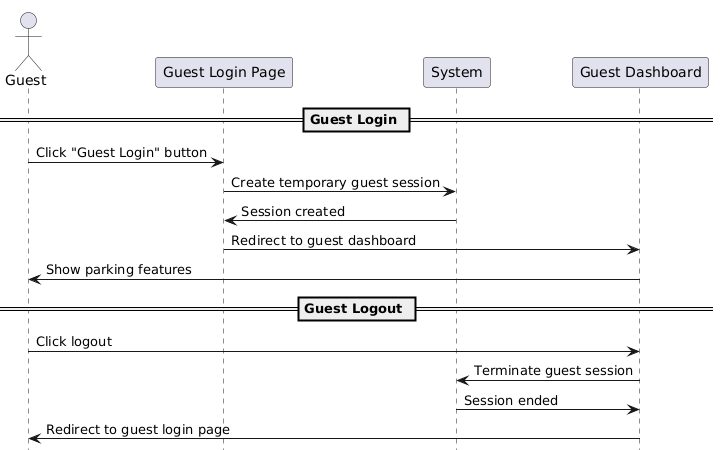

Figure 3.7: Guest Login and Logout

Table 3.6: Guest Login and Logout
<table>
<colgroup>
<col style="width: 23%" />
<col style="width: 76%" />
</colgroup>
<tbody>
<tr>
<td>Field</td>
<td>Description</td>
</tr>
<tr>
<td>ID</td>
<td>REQSQ002</td>
</tr>
<tr>
<td>Feature</td>
<td>Guest Login and Logout</td>
</tr>
<tr>
<td>Version</td>
<td>1.0</td>
</tr>
<tr>
<td>Purpose</td>
<td>To allow guests to access parking services without credentials</td>
</tr>
<tr>
<td>Actor</td>
<td>Guest</td>
</tr>
<tr>
<td>Precondition</td>
<td>Guest navigates to guest login page</td>
</tr>
<tr>
<td>Postcondition</td>
<td>Guest is granted temporary access and redirected to the guest
dashboard</td>
</tr>
<tr>
<td>Main Flow</td>
<td>
1. Guest clicks “Guest Login”

2. System creates guest session

3. System redirects to dashboard
</td>
</tr>
<tr>
<td>Alternate Scenario</td>
<td>1. If session creation fails, system displays an error</td>
</tr>
</tbody>
</table>

##### 3.1.2.3 Create Ride Offer
(Student and Staff)

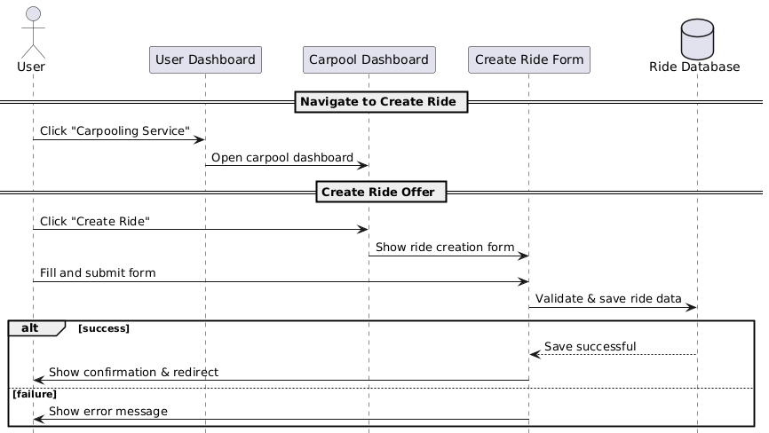

Figure 3.8: Create Ride Offer

Table 3.7: Create Ride Offer

<table>
<colgroup>
<col style="width: 24%" />
<col style="width: 75%" />
</colgroup>
<tbody>
<tr>
<td>Field</td>
<td>Description</td>
</tr>
<tr>
<td>ID</td>
<td>REQSQ003</td>
</tr>
<tr>
<td>Feature</td>
<td>Create Ride Offer</td>
</tr>
<tr>
<td>Version</td>
<td>1.0</td>
</tr>
<tr>
<td>Purpose</td>
<td>To allow users to create and publish a new carpooling ride
offer</td>
</tr>
<tr>
<td>Actor</td>
<td>Student / Staff</td>
</tr>
<tr>
<td>Precondition</td>
<td>User must be logged in</td>
</tr>
<tr>
<td>Postcondition</td>
<td>New ride offer is saved and listed in user's trip history</td>
</tr>
<tr>
<td>Main Flow</td>
<td>
1. User clicks "Carpooling Service"

2. System opens Carpool Dashboard

3. User clicks "Create Ride"

4. System shows ride creation form

5. User fills and submits

6. System validates and saves

7. System confirms and redirects
</td>
</tr>
<tr>
<td>Alternate Scenario</td>
<td>
1. If required fields are missing, system prompts user

2. If DB save fails, system shows error
</td>
</tr>
</tbody>
</table>

##### 3.1.2.4 Join Ride(Student
and Staff）

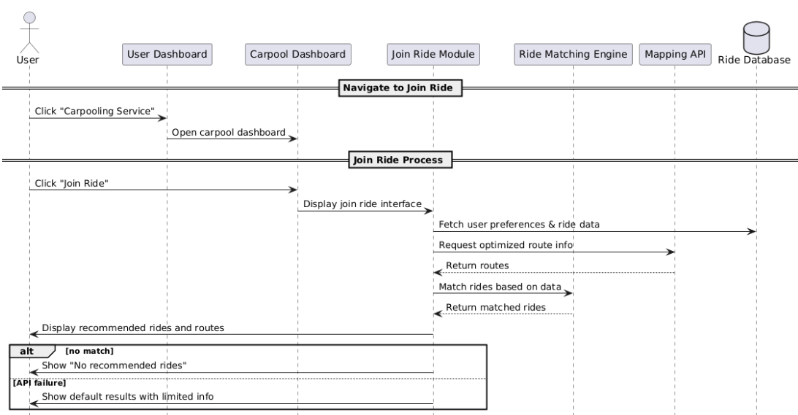

Figure 3.9: Join Ride

Table 3.8: Join Ride
<table>
<colgroup>
<col style="width: 24%" />
<col style="width: 75%" />
</colgroup>
<tbody>
<tr>
<td>Field</td>
<td>Description</td>
</tr>
<tr>
<td>ID</td>
<td>REQSQ005</td>
</tr>
<tr>
<td>Feature</td>
<td>View Recommended Matches and Routes (as part of Join Ride)</td>
</tr>
<tr>
<td>Version</td>
<td>1.0</td>
</tr>
<tr>
<td>Purpose</td>
<td>To provide users with personalized carpool matches and suggested
routes</td>
</tr>
<tr>
<td>Actor</td>
<td>Student / Staff</td>
</tr>
<tr>
<td>Precondition</td>
<td>User is logged in and clicks "Join Ride"</td>
</tr>
<tr>
<td>Postcondition</td>
<td>User sees best-matched rides with optimized routes</td>
</tr>
<tr>
<td>Main Flow</td>
<td>
1. User clicks "Carpooling Service"

2. System opens Carpool Dashboard

3. User clicks "Join Ride"

4. System fetches ride data and preferences

5. Mapping API is called

6. Results are matched and displayed
</td>
</tr>
<tr>
<td>Alternate Scenario</td>
<td>
1. If no matches, system shows “No recommended rides”

2. If API fails, system shows default results
</td>
</tr>
</tbody>
</table>

##### 3.1.2.5 View Recommended
Matches and Routes(Student and Staff）

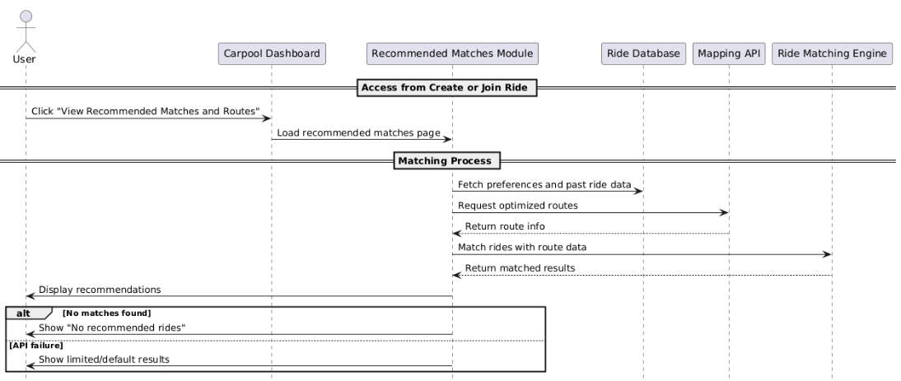

Figure 3.10: View Recommended Matches and Routes

Table 3.9: View Recommended Matches and Routes
<table>
<colgroup>
<col style="width: 19%" />
<col style="width: 80%" />
</colgroup>
<tbody>
<tr>
<td>Field</td>
<td>Description</td>
</tr>
<tr>
<td>ID</td>
<td>REQSQ005</td>
</tr>
<tr>
<td>Feature</td>
<td>View Recommended Matches and Routes</td>
</tr>
<tr>
<td>Version</td>
<td>1.0</td>
</tr>
<tr>
<td>Purpose</td>
<td>To provide users with personalized carpool matches and suggested
routes</td>
</tr>
<tr>
<td>Actor</td>
<td>Student / Staff</td>
</tr>
<tr>
<td>Precondition</td>
<td>User must be logged in with stored preferences or past ride
data</td>
</tr>
<tr>
<td>Postcondition</td>
<td>User views best-matched rides with optimized routes</td>
</tr>
<tr>
<td>Main Flow</td>
<td>
1. User opens "Recommended Matches and Routes"

2. System fetches ride data and preferences

3. System calls mapping API

4. System matches results

5. Recommendations displayed
</td>
</tr>
<tr>
<td>Alternate Scenario</td>
<td>
1. If no matches, system shows “No recommended rides”

2. If route API fails, system shows limited results
</td>
</tr>
</tbody>
</table>

##### 3.1.2.6 Manage Trip
Schedule and History(Student and Staff）

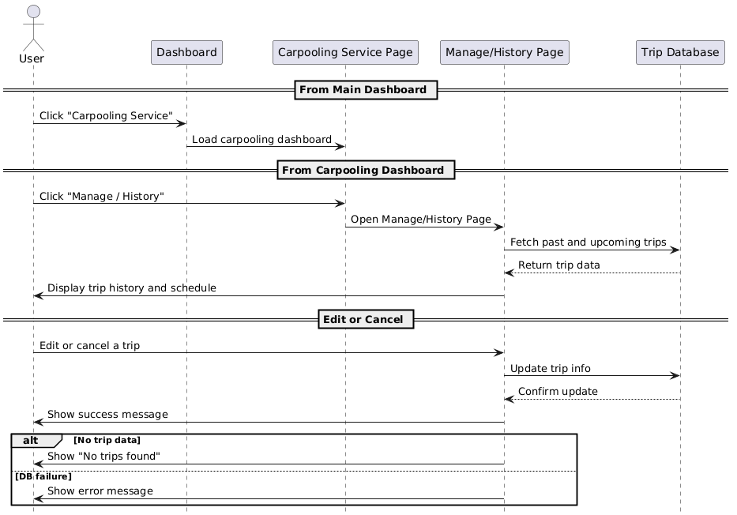

Figure 3.11: Manage Trip Schedule and History

<table>
<colgroup>
<col style="width: 22%" />
<col style="width: 77%" />
</colgroup>
<tbody>
<tr>
<td>Field</td>
<td>Description</td>
</tr>
<tr>
<td>ID</td>
<td>REQSQ006</td>
</tr>
<tr>
<td>Feature</td>
<td>Manage Trip Schedule and History</td>
</tr>
<tr>
<td>Version</td>
<td>1.0</td>
</tr>
<tr>
<td>Purpose</td>
<td>To allow users to view, edit, or cancel their trips and access trip
history</td>
</tr>
<tr>
<td>Actor</td>
<td>Student / Staff</td>
</tr>
<tr>
<td>Precondition</td>
<td>User must be logged in and have trip data (created via ride offer)
in the system</td>
</tr>
<tr>
<td>Postcondition</td>
<td>User views trip history or updated future trip details</td>
</tr>
<tr>
<td>Main Flow</td>
<td>
1. User logs in

2. Clicks "Carpooling Service"

3. Enters "Manage / History" page

4. System loads trips

5. Trips displayed

6. User edits/cancels

7. System updates and confirms
</td>
</tr>
<tr>
<td>Alternate Scenario</td>
<td>
1. If DB fails, system shows error

2. If no trips, system shows empty state
</td>
</tr>
</tbody>
</table>

##### 3.1.2.7 Report
Feature(Student and Staff）

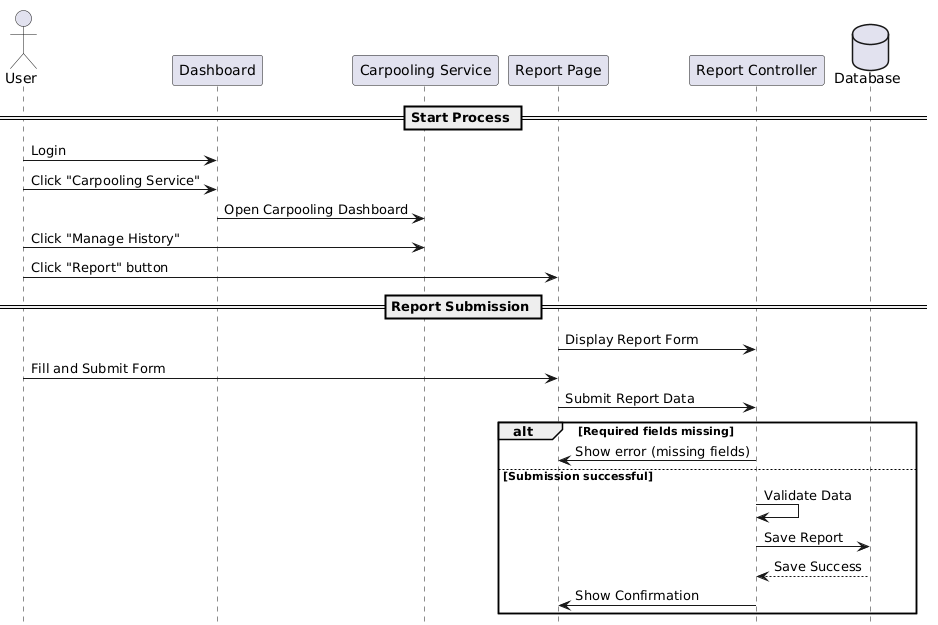

Figure 3.12: Report Feature

Table 3.7: Report Feature
<table>
<colgroup>
<col style="width: 17%" />
<col style="width: 82%" />
</colgroup>
<tbody>
<tr>
<td>Field</td>
<td>Description</td>
</tr>
<tr>
<td>ID</td>
<td>REQSQ007</td>
</tr>
<tr>
<td>Feature</td>
<td>Report Feature</td>
</tr>
<tr>
<td>Version</td>
<td>1.0</td>
</tr>
<tr>
<td>Purpose</td>
<td>To allow users to submit reports regarding issues or complaints</td>
</tr>
<tr>
<td>Actor</td>
<td>Student / Staff</td>
</tr>
<tr>
<td>Precondition</td>
<td>User is logged in and accesses the Report/Feedback page from
Carpooling Dashboard</td>
</tr>
<tr>
<td>Postcondition</td>
<td>Report is submitted and stored in the database; user receives
confirmation</td>
</tr>
<tr>
<td>Main Flow</td>
<td>
User logs in

User clicks “Carpooling Service”

User clicks “Manage History”

System displays Report / Feedback page

User clicks “Report” button

System displays the Report form

User fills in the report details and clicks Submit

System validates the input fields

System stores the report in the database

System shows confirmation message to the user
</td>
</tr>
<tr>
<td>Alternate Scenario</td>
<td>
If required fields are empty, the system prompts the user to
complete all mandatory fields

If submission fails due to a system error, an error message is
displayed to the user
</td>
</tr>
</tbody>
</table>

##### 3.1.2.8 View Real-time
Parking Availability（Except Admin)

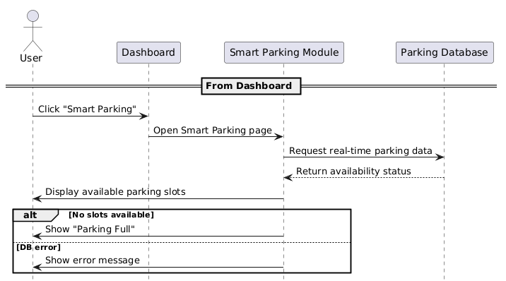

Figure 3.13: View Real-time Parking Availability

Table 3.8: View Real-time Parking Availability
<table>
<colgroup>
<col style="width: 23%" />
<col style="width: 76%" />
</colgroup>
<tbody>
<tr>
<td>Field</td>
<td>Description</td>
</tr>
<tr>
<td>ID</td>
<td>REQSQ008</td>
</tr>
<tr>
<td>Feature</td>
<td>View Real-time Parking Availability</td>
</tr>
<tr>
<td>Version</td>
<td>1.0</td>
</tr>
<tr>
<td>Purpose</td>
<td>To allow users to view current availability of parking slots</td>
</tr>
<tr>
<td>Actor</td>
<td>Student / Staff / Guest</td>
</tr>
<tr>
<td>Precondition</td>
<td>User is logged in (or guest accessed) and navigates to the Smart
Parking page</td>
</tr>
<tr>
<td>Postcondition</td>
<td>System displays updated parking availability</td>
</tr>
<tr>
<td>Main Flow</td>
<td>
1. User clicks "Smart Parking" on dashboard

2. System requests real-time data

3. Parking DB returns status

4. System displays available slots
</td>
</tr>
<tr>
<td>Alternate Scenario</td>
<td>
1. If parking DB is unavailable, system shows error

2. If no slots available, system shows "Full" message
</td>
</tr>
</tbody>
</table>

##### 3.1.2.9 Reserve Parking
Spot（Except Admin)

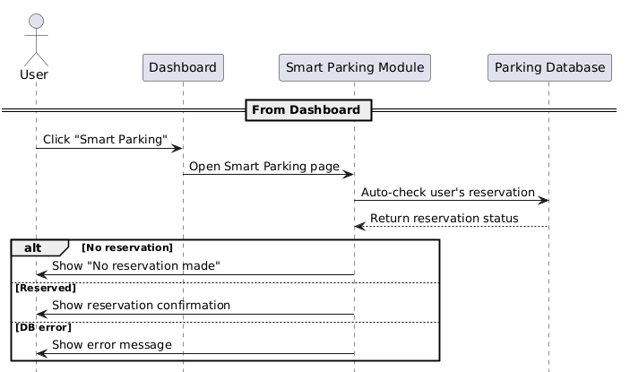

Figure 3.14:Reserve Parking Spot

Table 3.9: Reserve Parking Spot
<table>
<colgroup>
<col style="width: 20%" />
<col style="width: 79%" />
</colgroup>
<tbody>
<tr>
<td>Field</td>
<td>Description</td>
</tr>
<tr>
<td>ID</td>
<td>REQSQ009</td>
</tr>
<tr>
<td>Feature</td>
<td>Reserve Parking Spot</td>
</tr>
<tr>
<td>Version</td>
<td>1.0</td>
</tr>
<tr>
<td>Purpose</td>
<td>To allow users to check and confirm their reserved parking spot</td>
</tr>
<tr>
<td>Actor</td>
<td>Student / Staff / Guest</td>
</tr>
<tr>
<td>Precondition</td>
<td>User is logged in (or guest accessed) and has made a
reservation</td>
</tr>
<tr>
<td>Postcondition</td>
<td>User sees reservation details or system notifies of no
reservation</td>
</tr>
<tr>
<td>Main Flow</td>
<td>
1. User clicks "Smart Parking"

2. System checks for reservation

3. Reservation status returned

4. System displays confirmation or prompt
</td>
</tr>
<tr>
<td>Alternate Scenario</td>
<td>
1. If no reservation, system shows "No reservation made"

2. If DB fails, system shows error
</td>
</tr>
</tbody>
</table>

##### 3.1.2.10 Check Parking
Status （Except Admin)

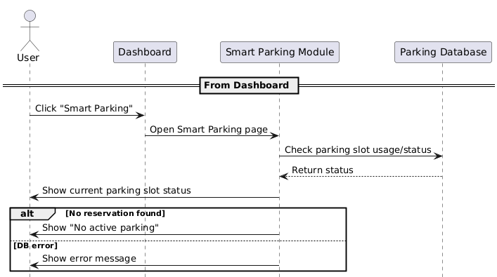

Figure 3.15:Check Parking Status

Table 3.10: Check Parking Status

<table>
<colgroup>
<col style="width: 20%" />
<col style="width: 79%" />
</colgroup>
<tbody>
<tr>
<td>Field</td>
<td>Description</td>
</tr>
<tr>
<td>ID</td>
<td>REQSQ010</td>
</tr>
<tr>
<td>Feature</td>
<td>Check Parking Status</td>
</tr>
<tr>
<td>Version</td>
<td>1.0</td>
</tr>
<tr>
<td>Purpose</td>
<td>To allow users to check their current parking usage status</td>
</tr>
<tr>
<td>Actor</td>
<td>Student / Staff / Guest</td>
</tr>
<tr>
<td>Precondition</td>
<td>User is logged in (or guest accessed) and has previously reserved a
parking slot</td>
</tr>
<tr>
<td>Postcondition</td>
<td>System displays real-time status of the user's parking slot</td>
</tr>
<tr>
<td>Main Flow</td>
<td>
1. User clicks "Smart Parking"

2. System checks current status of parking slot

3. Status is returned

4. User views real-time status
</td>
</tr>
<tr>
<td>Alternate Scenario</td>
<td>
1. If no reservation found, system shows "No active parking"

2. If DB fails, system shows error
</td>
</tr>
</tbody>
</table>

##### 3.1.2.11 Admin Login

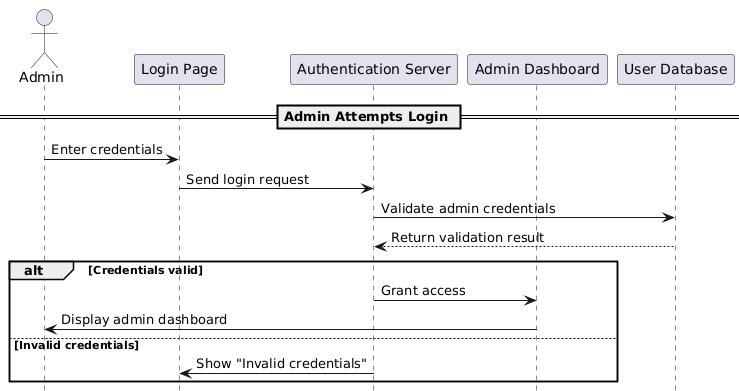

Figure 3.16: Admin Login

Table 3.11: Admin Login
<table>
<colgroup>
<col style="width: 21%" />
<col style="width: 78%" />
</colgroup>
<tbody>
<tr>
<td>Field</td>
<td>Description</td>
</tr>
<tr>
<td>ID</td>
<td>REQSQ011</td>
</tr>
<tr>
<td>Feature</td>
<td>Admin Login</td>
</tr>
<tr>
<td>Version</td>
<td>1.0</td>
</tr>
<tr>
<td>Purpose</td>
<td>To allow administrators to securely access the system via login
credentials</td>
</tr>
<tr>
<td>Actor</td>
<td>Admin</td>
</tr>
<tr>
<td>Precondition</td>
<td>Admin has a valid account and accesses the login page</td>
</tr>
<tr>
<td>Postcondition</td>
<td>Admin is redirected to the admin dashboard upon successful
login</td>
</tr>
<tr>
<td>Main Flow</td>
<td>
1. Admin enters credentials

2. System validates credentials

3. If valid, admin is redirected to dashboard
</td>
</tr>
<tr>
<td>Alternate Scenario</td>
<td>1. If credentials are invalid, system shows error message</td>
</tr>
</tbody>
</table>

##### 3.1.2.12 Access
Carpooling Data & Review Reports and Complaints (Admin)

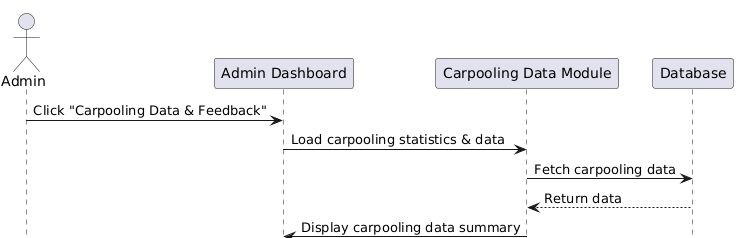

Figure 3.17: Access Carpooling Data & Review Reports and Complaints

Table 3.12: Access Carpooling Data & Review Reports and Complaints
<table>
<colgroup>
<col style="width: 20%" />
<col style="width: 79%" />
</colgroup>
<tbody>
<tr>
<td>Field</td>
<td>Description</td>
</tr>
<tr>
<td>ID</td>
<td>REQSQ012</td>
</tr>
<tr>
<td>Feature</td>
<td>Access Carpooling Data &amp; Review Reports and Complaints</td>
</tr>
<tr>
<td>Version</td>
<td>1.0</td>
</tr>
<tr>
<td>Purpose</td>
<td>To allow admins to view carpooling data and access detailed reports
and complaints submitted by users</td>
</tr>
<tr>
<td>Actor</td>
<td>Admin</td>
</tr>
<tr>
<td>Precondition</td>
<td>Admin must be logged in and access the admin dashboard</td>
</tr>
<tr>
<td>Postcondition</td>
<td>Carpooling data is displayed; reports and complaints are accessible
after clicking feedback button</td>
</tr>
<tr>
<td>Main Flow</td>
<td>
1. Admin clicks "Carpooling Data &amp; Feedback"

2. System loads carpooling data

3. Admin clicks "Feedback" button

4. System loads reports and complaints
</td>
</tr>
<tr>
<td>Alternate Scenario</td>
<td>1. If data retrieval fails, system shows error message</td>
</tr>
</tbody>
</table>

##### 3.1.2.12 Access
Carpooling Data (Admin)

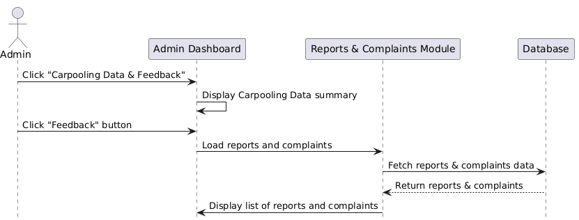

Figure 3.18: Review Reports and Complaints

Table 3.13: Review Reports and Complaints
<table>
<colgroup>
<col style="width: 20%" />
<col style="width: 79%" />
</colgroup>
<tbody>
<tr>
<td>Field</td>
<td>Description</td>
</tr>
<tr>
<td>ID</td>
<td>REQSQ012B</td>
</tr>
<tr>
<td>Feature</td>
<td>Review Reports and Complaints</td>
</tr>
<tr>
<td>Version</td>
<td>1.0</td>
</tr>
<tr>
<td>Purpose</td>
<td>To allow admins to review user-submitted reports and complaints</td>
</tr>
<tr>
<td>Actor</td>
<td>Admin</td>
</tr>
<tr>
<td>Precondition</td>
<td>Admin must be logged in and access the admin dashboard</td>
</tr>
<tr>
<td>Postcondition</td>
<td>Reports and complaints list is displayed after clicking the feedback
button</td>
</tr>
<tr>
<td>Main Flow</td>
<td>
1. Admin clicks "Carpooling Data &amp; Feedback"

2. Admin clicks "Feedback" button

3. System loads and displays reports and complaints
</td>
</tr>
<tr>
<td>Alternate Scenario</td>
<td>1. If data retrieval fails, system shows error message</td>
</tr>
</tbody>
</table>

##### 3.1.2.14 Manage User
Accounts (Admin)

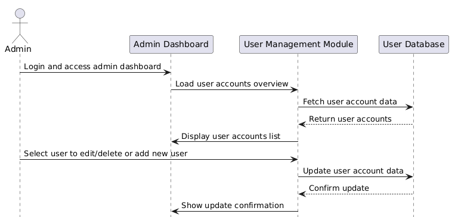

Figure 3.19: Manage User Accounts

Table 3.14: Manage User Accounts
<table>
<colgroup>
<col style="width: 20%" />
<col style="width: 79%" />
</colgroup>
<tbody>
<tr>
<td>Field</td>
<td>Description</td>
</tr>
<tr>
<td>ID</td>
<td>REQSQ013</td>
</tr>
<tr>
<td>Feature</td>
<td>Manage User Accounts</td>
</tr>
<tr>
<td>Version</td>
<td>1.0</td>
</tr>
<tr>
<td>Purpose</td>
<td>To allow admin to view, add, edit, or delete user accounts</td>
</tr>
<tr>
<td>Actor</td>
<td>Admin</td>
</tr>
<tr>
<td>Precondition</td>
<td>Admin must be logged in and have accessed the admin dashboard</td>
</tr>
<tr>
<td>Postcondition</td>
<td>User accounts data is displayed and admin can manage accounts</td>
</tr>
<tr>
<td>Main Flow</td>
<td>
1. Admin logs in and enters admin dashboard

2. System loads user accounts

3. Admin edits/adds/deletes user

4. System updates DB and confirms
</td>
</tr>
<tr>
<td>Alternate Scenario</td>
<td>1. If database fails, system shows error message</td>
</tr>
</tbody>
</table>

##### 3.1.2.15 Access Parking
Data (Admin)

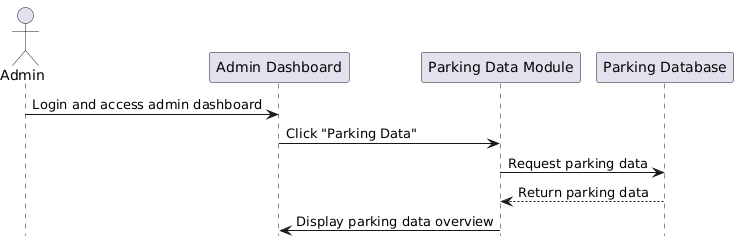

Figure 3.20: Access Parking Data

Table 3.15: Access Parking Data
<table>
<colgroup>
<col style="width: 20%" />
<col style="width: 79%" />
</colgroup>
<tbody>
<tr>
<td>Field</td>
<td>Description</td>
</tr>
<tr>
<td>ID</td>
<td>REQSQ014</td>
</tr>
<tr>
<td>Feature</td>
<td>Access Parking Data</td>
</tr>
<tr>
<td>Version</td>
<td>1.0</td>
</tr>
<tr>
<td>Purpose</td>
<td>To allow admin to view parking usage data and statistics</td>
</tr>
<tr>
<td>Actor</td>
<td>Admin</td>
</tr>
<tr>
<td>Precondition</td>
<td>Admin must be logged in and access the admin dashboard</td>
</tr>
<tr>
<td>Postcondition</td>
<td>Parking data is displayed to the admin</td>
</tr>
<tr>
<td>Main Flow</td>
<td>
1. Admin logs in and accesses admin dashboard

2. Admin clicks "Parking Data"

3. System retrieves parking data

4. Data displayed to admin
</td>
</tr>
<tr>
<td>Alternate Scenario</td>
<td>1. If database fails, system shows error message</td>
</tr>
</tbody>
</table>

### 3.2 Performance
Requirements

This section defines the performance and quality expectations for the
Campus Ride-Sharing and Parking Integration System. These requirements
ensure the system delivers a responsive, stable, and scalable user
experience under different load conditions. The table below outlines the
desired performance characteristics to meet user needs effectively.

Table 3.1: Performance Requirements
|  |  |  |
|:---|:---|:---|
| Requirement ID | Description | Priority |
| REQ_P001 | The system shall respond to user interactions (e.g., booking, joining a ride) within 0 to 3 seconds. | High |
| REQ_P002 | The platform shall support up to 5,000 concurrent users without performance degradation. | High |
| REQ_P003 | The system shall ensure 99.9% uptime availability excluding scheduled maintenance periods. | High |
| REQ_P004 | Real-time parking data shall be retrieved and displayed within 2 seconds. | Medium |
| REQ_P005 | The system shall process up to 100,000 ride-sharing and parking transactions daily without performance loss. | High |
| REQ_P006 | User dashboards and trip/parking history shall load within 1 second. | Medium |
| REQ_P007 | Ride creation, join requests, and parking reservations shall be processed in under 1 second. | High |
| REQ_P008 | The system shall maintain database transaction latency below 100ms. | Medium |
| REQ_P009 | The system shall support horizontal scaling to handle growth in users and data. | High |
| REQ_P010 | The system shall maintain a crash rate of less than 1 crash per 10,000 sessions. | Medium |
| REQ_P011 | Administrative reports and analytics shall be generated within 5 seconds of request. | Medium |
| REQ_P012 | The system shall perform automatic backups with a maximum data loss window of 1 hour. | High |
| REQ_P013 | Real-time ride and parking notifications shall be delivered to users within 1 second. | High |
| REQ_P014 | The system shall use load balancing techniques to efficiently distribute user requests across servers. | High |
| REQ_P015 | Secure communications shall use encryption with a processing delay of less than 50ms. | Medium |

### 3.3 Usability
Requirements

This section outlines the usability expectations for the Campus
Ride-Sharing and Parking Integration System. These requirements aim to
enhance user satisfaction by providing a smooth, intuitive, and
accessible experience for all types of users, including students, staff,
guests, and administrators. The table below details each usability
requirement.

Table 3.2: Usability Requirements
|  |  |  |
|:---|:---|:---|
| Requirement ID | Description | Priority |
| REQ_UR001 | The system shall provide a seamless login experience using university credentials or guest access. | High |
| REQ_UR002 | The interface shall display relevant real-time updates such as parking availability and ride offers. | Medium |
| REQ_UR003 | Users shall be able to share their ride details or parking bookings with others through a unique shareable link. | High |
| REQ_UR004 | The platform shall include a notification system to alert users of trip changes, new ride matches, or parking status updates. | Medium |
| REQ_UR005 | The interface shall offer a clean, responsive, and intuitive design to minimize user confusion and cognitive load. | High |
| REQ_UR006 | The admin dashboard shall provide usage analytics and feedback summaries from users regarding ride and parking experiences. | Medium |
| REQ_UR007 | The platform shall integrate with campus services (e.g., maps, timetable systems) for enhanced navigation and scheduling. | High |
| REQ_UR008 | Users shall be able to customize their dashboard to show preferred features such as parking status or trip history. | Low |
| REQ_UR009 | The platform shall provide onboarding tutorials and tooltips to guide first-time users through core features. | Medium |
| REQ_UR010 | The platform shall protect user data during all interactions, especially during login and trip/parking sharing. | High |
| REQ_UR011 | The platform shall be fully mobile-friendly and responsive, ensuring smooth use on smartphones and tablets. | High |
| REQ_UR012 | The system shall offer a feedback form where users can report issues or suggest improvements for usability. | Medium |
| REQ_UR013 | Users shall be able to tag co-riders or carpool buddies in ride details for better coordination. | Low |
| REQ_UR014 | The platform shall include accessibility features such as screen reader compatibility, color contrast, and keyboard navigation. | High |
| REQ_UR015 | The system shall be regularly updated to maintain compatibility with browsers and device operating systems. | Medium |

### 3.4 Interface
Requirements

#### 3.4.1 System Interfaces

The Campus Ride-Sharing and Parking Integration System interfaces with
several subsystems and external services to enable seamless operations
across authentication, ride-sharing, parking management, and
administrative analytics. These interfaces ensure secure data exchange,
role-based access control, and real-time system feedback, providing a
smooth experience for all users including students, staff, guests, and
administrators.

Table 3.3: System Interfaces
|  |  |  |  |
|:---|:---|:---|:---|
| Interface ID | System Name | Description | Details |
| REQ_SI001 | Authentication Server | Handles login and access control for students, staff, guests, and admins | Supports university SSO and guest login via secure protocols (e.g., OAuth 2.0, JWT) |
| REQ_SI002 | Carpooling Server | Manages ride creation, joining, scheduling, reporting & admin data access | APIs for ride offer, match recommendations, trip history, and report data |
| REQ_SI003 | Parking Management Server | Manages smart parking, admin usage logs, and parking analytics | Provides real-time data, reservations, and logs accessible by admin |
| REQ_SI004 | Notification Service | Sends alerts to users across all roles including report and admin use | API integration with email/SMS (e.g., SendGrid, Twilio) |
| REQ_SI005 | Map & Route API | Recommends optimal carpool routes | Connects to map services (e.g., Google Maps) for location and routing |

#### 3.4.2 User Interfaces

The following outlines the user interface design principles for the
Campus Ride-Sharing and Parking Integration System. All visual elements,
layouts, and user interaction components are designed for clarity,
accessibility, and consistency, adhering to the Multimedia University
(MMU) branding and the administrative dashboard interface style.

Table 3.4: User Interfaces
|  |  |  |
|:---|:---|:---|
| Module ID | Description | Priority |
| REQ_UI001 | The overall GUI uses a primary white content background, with light gray panels (#D3D3D3) for sidebars and subtle shadowed containers. | High |
| REQ_UI002 | The left sidebar layout is persistent across all pages, using black icons with dark gray labels (#333333) in Roboto, size 14pt. | High |
| REQ_UI003 | The system font family is Roboto for all interface text and Roboto Slab for headers or section titles. | Medium |
| REQ_UI004 | Text colors follow a consistent theme: Dark Gray (#333333) for body text, and White (#FFFFFF) when displayed over colored buttons or bars. | High |
| REQ_UI005 | Font sizes are structured for readability: 14pt minimum, 16pt standard text, 20pt subtitles, and 32pt section headers. | High |
| REQ_UI006 | Font weight is medium (500) for general content and bold for headers and actionable elements (e.g., button text, section titles). | High |
| REQ_UI007 | Buttons are color-coded by function: Bright Blue (#007BFF) for primary actions (e.g., Edit, Logout), Red (#FF4136) for Delete/warnings. | Medium |
| REQ_UI008 | Buttons use white text, have slightly rounded corners, and consistent padding with hover feedback (slight shade or pointer change). | Medium |
| REQ_UI009 | Tables are styled with no outer borders, clear column headers, and use padding and spacing to separate content for clean visibility. | High |
| REQ_UI010 | Icons and labels in navigation menus are vertically aligned, maintain equal spacing, and ensure usability even on mid-sized screens. | Medium |
| REQ_UI011 | The top navigation bar includes user role display, a Logout button styled in blue (#007BFF), and an icon for intuitive access. | High |
| REQ_UI012 | All interfaces are designed for desktop resolution first, with flexible layout containers that prevent horizontal scrolling. | Medium |

#### 3.4.3 Hardware Interfaces

The Campus Ride-Sharing and Parking Integration System is designed to be
accessible via a range of devices including desktops, laptops, tablets,
and smartphones. To ensure smooth operation and access to all features,
the devices should meet the following minimum hardware specifications.
Devices that do not meet these requirements may experience degraded
performance or limited functionality.

Table 3.5: Hardware Interfaces Requirements
|  |  |
|:---|:---|
| Interface ID | Description |
| REQ_HI001 | The processor of the device shall be at least a 64-bit processor (e.g., Intel Core i3 or equivalent) for optimal performance |
| REQ_HI002 | The device shall have a minimum of 4GB RAM to support multitasking and real-time data processing |
| REQ_HI003 | The device shall have at least 2GB of free storage space to accommodate application data and cache |
| REQ_HI004 | The device must support internet connectivity via Ethernet, Wi-Fi, or mobile data networks to enable real-time updates and communication |

#### 3.4.4 Software Interfaces

The Campus Ride-Sharing and Parking Integration System depends on
various software components and platforms to operate effectively. Below
is a detailed list of software interfaces required for system
functionality:

Table 3.6: Software Interfaces
|  |  |  |  |  |  |
|:---|:---|:---|:---|:---|:---|
| ID | Category | Name | Version Number | Purpose | Reference |
| REQ_SI001 | Operating System | Microsoft Windows | Windows 10 or later | Software platform managing device hardware and resources to support system execution | Microsoft Official Page |
|  |  | macOS | macOS Mojave 10.14 or later |  | Apple Official Page |
|  |  | Linux | Ubuntu 20.04+, Debian 11+, Fedora 40+ |  | Linux Distribution Pages |
|  |  | iOS | iOS 15.0 or later |  | Apple Official Page |
|  |  | Android | Android 10.0 or later |  | Android Official Page |
| REQ_SI002 | Browser | Google Chrome | 124.0.6367.159 | Used by end users to access the web application and communicate with the server | Chrome Official Page |
|  |  | Microsoft Edge | 124.0.2478.80 |  | Microsoft Edge Official Page |
|  |  | Safari | 16.6.1 |  | Safari Official Page |
| REQ_SI003 | Database | MySQL | 8.0 or later | Database system used to store and manage data for users, trips, parking, and analytics | MySQL Official Page |
| REQ_SI004 | Backend Server | Node.js | 18.x or later | Server runtime environment for handling API requests and business logic | Node.js Official Page |
| REQ_SI005 | API Framework | Express.js | 4.x | Framework for building RESTful APIs to support client-server communication | Express Official Page |

#### 3.4.5 Communications
Interfaces

This section outlines the communication interfaces and protocols used by
the Campus Ride-Sharing and Parking Integration System to interact with
users, external services, and other systems.

Table 1.6: Communications Interfaces
<table>
<colgroup>
<col style="width: 15%" />
<col style="width: 50%" />
<col style="width: 19%" />
<col style="width: 14%" />
</colgroup>
<tbody>
<tr>
<td style="text-align: left;">Interface ID</td>
<td style="text-align: left;">Description</td>
<td style="text-align: left;">
Protocols/

Methods
</td>
<td style="text-align: left;">Priority</td>
</tr>
<tr>
<td style="text-align: left;">REQ_CI001</td>
<td style="text-align: left;">The system shall support HTTP/HTTPS
protocols for secure web communication</td>
<td style="text-align: left;">HTTP/HTTPS</td>
<td style="text-align: left;">High</td>
</tr>
<tr>
<td style="text-align: left;">REQ_CI002</td>
<td style="text-align: left;">The system shall integrate with university
authentication services for user login (e.g., SAML, OAuth)</td>
<td style="text-align: left;">SAML, OAuth 2.0</td>
<td style="text-align: left;">High</td>
</tr>
<tr>
<td style="text-align: left;">REQ_CI003</td>
<td style="text-align: left;">The system shall use WebSocket protocol
for real-time updates, notifications, and ride matching</td>
<td style="text-align: left;">WebSocket</td>
<td style="text-align: left;">Medium</td>
</tr>
<tr>
<td style="text-align: left;">REQ_CI004</td>
<td style="text-align: left;">The system shall support SMTP for sending
emails to users for notifications, booking confirmations, and
alerts</td>
<td style="text-align: left;">SMTP</td>
<td style="text-align: left;">Medium</td>
</tr>
<tr>
<td style="text-align: left;">REQ_CI005</td>
<td style="text-align: left;">The system shall support integration with
campus LDAP or Active Directory for user authentication and
management</td>
<td style="text-align: left;">LDAP/Active Directory</td>
<td style="text-align: left;">High</td>
</tr>
<tr>
<td style="text-align: left;">REQ_CI006</td>
<td style="text-align: left;">The system shall support secure file
transfer protocol (SFTP) for exchanging files with external systems</td>
<td style="text-align: left;">SFTP</td>
<td style="text-align: left;">Medium</td>
</tr>
<tr>
<td style="text-align: left;">REQ_CI007</td>
<td style="text-align: left;">The system shall ensure response time for
ride offer posting and updates to be under 1 second</td>
<td style="text-align: left;">MQTT</td>
<td style="text-align: left;">Low</td>
</tr>
<tr>
<td style="text-align: left;">REQ_CI008</td>
<td style="text-align: left;">The system shall enable data exchange with
external databases through JDBC/ODBC connections</td>
<td style="text-align: left;">JDBC/ODBC</td>
<td style="text-align: left;">Medium</td>
</tr>
<tr>
<td style="text-align: left;">REQ_CI009</td>
<td style="text-align: left;">The system shall support JSON and XML data
formats for data interchange between clients and servers</td>
<td style="text-align: left;">JSON, XML</td>
<td style="text-align: left;">High</td>
</tr>
</tbody>
</table>

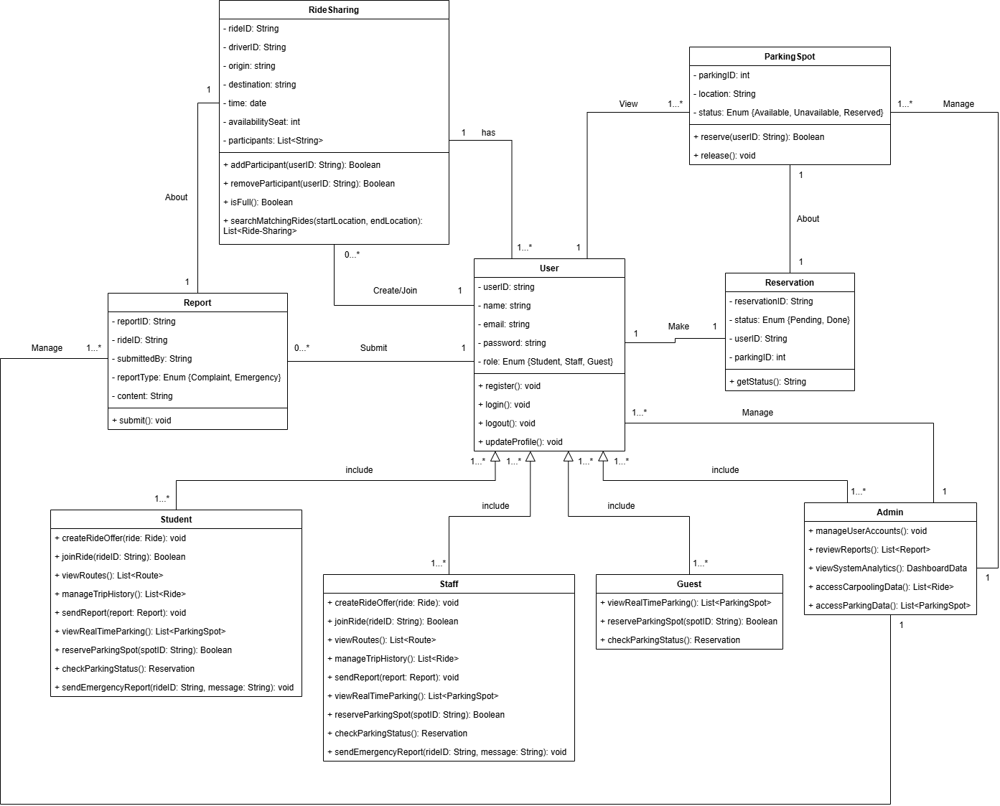3.5
Logical Database Requirements

Figure 3.1: Class Diagram

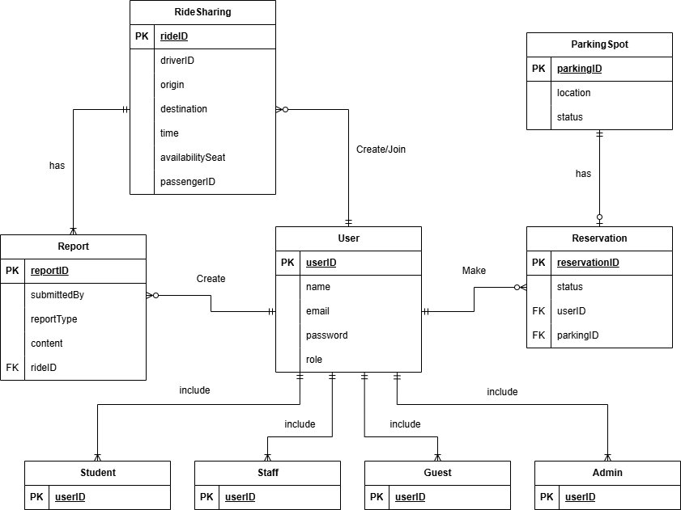

Figure 3.2: Entity Relationship Diagram

The Entity-Relationship Diagram (ERD) represents the structure and
relationship between the system entities of Campus Ride-Sharing Platform
with Parking Integration System. The primary entities are User,
RideSharing, Reservation, Report, and ParkingSpot with user role
extensions as Student, Staff, Guest, and Admin. The system maintains the
user data integration in the User entity with the general properties of
name, email, and password and handles the specialized roles through
subtype entities for them. Users can give ride-sharing rides either as
drivers or ride on rides by using the RideSharing entity, and trip
reports can be given by using the Report entity. Parking is managed by
the Reservation entity, where users are referenced within individual
ParkingSpot records to reserve their spots. ERD accurately illustrates
how each entity enables others in the system to enable operations such
as providing rides, accident reporting, and parking reservation, while
possessing role-based operations and permissions.

#### 3.5.1 User

Table 3.4: User Data Dictionary

|  |  |  |  |  |
|:---|:---|:---|:---|:---|
| Field Name | Description | Data Type | Constraints | Extra Notes |
| userID | Unique identifier for each user. | Integer (PK) | PK, Not Null | Used as university login credentials |
| name | Full name of the user. | Varchar (50) | Not Null | Used as guest login credentials |
| email | Email address of the user. | Varchar (50) | Unique, Not Null | \- |
| password | Encrypted user password. | Varchar (30) | Not Null | Used as login credentials |
| role | Role of the user (student, staff, admin, guest). | Varchar (10) | Not Null | \- |

#### 3.5.2 Student

Table 3.5: Student Data Dictionary
|  |  |  |  |  |
|:---|:---|:---|:---|:---|
| Field Name | Description | Data Type | Constraints | Extra Notes |
| studentID | Unique ID for student user. | Integer | PK, FK to User(userID), Not Null | \- |

#### 3.5.3 Staff

Table 3.6: Staff Data Dictionary
|  |  |  |  |  |
|:---|:---|:---|:---|:---|
| Field Name | Description | Data Type | Constraints | Extra Notes |
| staffID | Unique ID for staff user. | Integer | PK, FK to User(userID), Not Null | \- |

3.5.4 Guest

Table 3.7: Guest Data Dictionary

|  |  |  |  |  |
|:---|:---|:---|:---|:---|
| Field Name | Description | Data Type | Constraints | Extra Notes |
| guestID | Unique ID for guest user. | Integer | PK, FK to User(userID), Not Null | \- |

#### 3.5.5 Admin

Table 3.8: Admin Data Dictionary
|  |  |  |  |  |
|:---|:---|:---|:---|:---|
| Field Name | Description | Data Type | Constraints | Extra Notes |
| adminID | Unique ID for admin user. | Integer | PK, FK to User(userID), Not Null | \- |

#### 3.5.6 RideSharing

Table 3.9: RideSharing Data Dictionary
|  |  |  |  |  |
|:---|:---|:---|:---|:---|
| Field Name | Description | Data Type | Constraints | Extra Notes |
| rideID | Unique identifier for each ride. | Integer | PK, Not Null | \- |
| driverID | ID of the user offering the ride. | Integer | Not Null | \- |
| origin | Starting location. | Varchar | Not Null | \- |
| destination | Destination location. | Varchar | Not Null | \- |
| time | Departure time. | Datetime | Not Null | \- |
| availabilitySeat | Available seats. | Integer | Not Null | \- |
| userID | References the user offering the ride. | Integer | FK to User(userID), Not Null | Used to record who joined this trips |

#### 3.5.7 Report

Table 3.10: Report Data Dictionary
|  |  |  |  |  |
|:---|:---|:---|:---|:---|
| Field Name | Description | Data Type | Constraints | Extra Notes |
| reportID | Unique report ID. | Integer | PK, Not Null | \- |
| rideID | Associated ride. | Integer | FK to RideSharing (rideID), Not Null | \- |
| submittedBy | Reporting user. | Varchar (50) | Not Null | \- |
| reportType | Type of report. | Varchar (20) | Not Null | \- |
| content | Report details. | Text | Not Null | \- |

#### 3.5.8 ParkingSpot

Table 3.11: ParkingSpot Data Dictionary
|            |                         |               |              |             |
|:-----------|:------------------------|:--------------|:-------------|:------------|
| Field Name | Description             | Data Type     | Constraints  | Extra Notes |
| parkingID  | Unique parking spot ID. | Integer       | PK, Not Null | \-          |
| location   | Spot location.          | Varchar (100) | Not Null     | \-          |
| status     | Availability status.    | Varchar (10)  | Not Null     | \-          |

#### 3.5.9 Reservation

Table 3.12: Reservation Data Dictionary

|  |  |  |  |  |
|:---|:---|:---|:---|:---|
| Field Name | Description | Data Type | Constraints | Extra Notes |
| reservationID | Unique reservation ID. | Integer | PK, Not Null | \- |
| status | Reservation status. | Varchar (10) | Not Null | \- |
| userID | Reserving user. | Integer | FK to User (userID), Not Null | \- |
| parkingID | Reserved parking spot. | Integer | FK to ParkingSpot (parkingID), Not Null | \- |

### 3.6 Design Constraints

This section records the design constraints and limitations that ought
to be considered throughout the whole Ride-Sharing and Parking
Management System development. The design constraints can be hardware
constraints, software constraints, regulatory and standard constraints,
social and cultural constraints, and organizational constraints.

Table 3.13: Design Constraints
|  |  |  |  |
|:---|:---|:---|:---|
| Requirement ID | Description | Priority | Author |
| REQ_DC001 | The system must comply with Web Content Accessibility Guidelines (WCAG) to ensure usability for all users, including those with disabilities. | Medium | Francis Wong Wei Hou |
| REQ_DC002 | The system must comply with applicable data protection regulations (GDPR) to protect user data like names, emails, and ride/parking details. | High | Francis Wong Wei Hou |
| REQ_DC003 | The system must be developed within a 1-year period to meet organizational or campus deployment deadlines. | High | Francis Wong Wei Hou |
| REQ_DC004 | The system must not display or allow any offensive content in ride descriptions, reports, or user profiles. | Medium | Francis Wong Wei Hou |
| REQ_DC005 | The system must use open-source libraries and frameworks approved by the organization. | Medium | Francis Wong Wei Hou |
| REQ_DC006 | The system must be compatible with major web browsers (Google Chrome, Firefox, Safari, Microsoft Edge) and support mobile devices (iOS and Android). | High | Francis Wong Wei Hou |
| REQ_DC007 | The system must enforce strict role-based access control (Guests can only view parking, Admins can manage accounts) to prevent unauthorized access. | High | Francis Wong Wei Hou |
| REQ_DC008 | The system must integrate with existing campus IT systems (user authentication via SSO, parking databases) without major infrastructure changes. | High | Francis Wong Wei Hou |
| REQ_DC009 | The system must support real-time updates for parking spot availability and ride-sharing status to ensure accurate information for users. | High | Francis Wong Wei Hou |
| REQ_DC010 | The system must be designed with a modular architecture to handle an increasing number of users and future feature additions. | High | Francis Wong Wei Hou |
| REQ_DC011 | The system must incorporate data encryption for sensitive user data (userID, email, ride details) in transit and at rest, per organizational IT security policies. | High | Francis Wong Wei Hou |
| REQ_DC012 | The system must ensure reports submitted by users are reliably logged and immediately accessible to Admins for quick response. | High | Francis Wong Wei Hou |

### 3.7 Software system
attributes

In this subsection, the necessary characteristics and traits of the
Ride-Sharing and Parking Management System are specified. These traits
ensure that the system meets the needs of all user roles (Students,
Staff, Guests, Admins) and functions properly when combined with
real-time data and capabilities. The system should achieve these traits
in order to meet those needs.

#### 3.7.1 Accuracy

Table 3.14: Accuracy
|  |  |  |  |
|----|----|----|----|
| Requirement ID | Description | Priority | Author |
| REQ_SRA001 | The system shall have an error rate of less than 0.0001% in all computational processes | High | Francis Wong Wei Hou |

#### 3.7.2 Availability

Table 3.15: Availability
|  |  |  |  |
|----|----|----|----|
| Requirement ID | Description | Priority | Author |
| REQ_SRA002 | The system’s server shall maintain consistent uptime with a maximum of 12 hours of downtime per year. | High | Francis Wong Wei Hou |

#### 3.7.3 Maintainability

Table 3.16: Maintainability
|  |  |  |  |
|----|----|----|----|
| Requirement ID | Description | Priority | Author |
| REQ_SRA003 | The system shall be designed with modular components to allow updates or bug fixes within 24 hours without affecting other functionalities. | High | Francis Wong Wei Hou |
| REQ_SRA004 | The system shall include detailed documentation for all code and processes to facilitate future maintenance by developers. | Medium | Francis Wong Wei Hou |

#### 3.7.4 Portability

Table 3.17: Portability

<table>
<colgroup>
<col style="width: 21%" />
<col style="width: 44%" />
<col style="width: 15%" />
<col style="width: 18%" />
</colgroup>
<tbody>
<tr>
<td>Requirement ID</td>
<td>Description</td>
<td>Priority</td>
<td>Author</td>
</tr>
<tr>
<td>REQ_SRA005</td>
<td>The system shall operate on multiple platforms (Windows, macOS,
Linux for servers; iOS, Android for mobile) without requiring
significant changes.</td>
<td>High</td>
<td>Francis Wong Wei Hou</td>
</tr>
<tr>
<td>REQ_SRA006</td>
<td>
The system shall use platform-

independent technologies (web-based frontend, REST APIs) to ensure
compatibility across environments.
</td>
<td>High</td>
<td>Francis Wong Wei Hou</td>
</tr>
</tbody>
</table>

#### 3.7.5 Reliability

Table 3.18: Reliability
|  |  |  |  |
|----|----|----|----|
| Requirement ID | Description | Priority | Author |
| REQ_SRA007 | The system shall handle a high volume of transactions and concurrent users without crashing. | High | Francis Wong Wei Hou |
| REQ_SRA008 | All transactions shall be recorded accurately, ensuring no data loss or corruption. | High | Francis Wong Wei Hou |
| REQ_SRA009 | The system shall receive notifications for the success or failure of their actions within the platform. | High | Francis Wong Wei Hou |

#### 3.7.6 Security

Table 3.19: Security

<table>
<colgroup>
<col style="width: 21%" />
<col style="width: 44%" />
<col style="width: 15%" />
<col style="width: 18%" />
</colgroup>
<tbody>
<tr>
<td>Requirement ID</td>
<td>Description</td>
<td>Priority</td>
<td>Author</td>
</tr>
<tr>
<td>REQ_SRA010</td>
<td>
The system shall use encryption

(HTTPS, AES-256) for all data transmission to protect user
information (userID, email, ride details).
</td>
<td>High</td>
<td>Francis Wong Wei Hou</td>
</tr>
<tr>
<td>REQ_SRA011</td>
<td>The system shall implement secure user authentication to prevent
unauthorized access.</td>
<td>High</td>
<td>Francis Wong Wei Hou</td>
</tr>
</tbody>
</table>

#### 3.7.7 Usability

Table 3.20: Usability
|  |  |  |  |
|----|----|----|----|
| Requirement ID | Description | Priority | Author |
| REQ_SRA012 | The system shall provide an intuitive interface, allowing users to complete tasks (reserving a parking spot, joining a ride) in fewer than 5 clicks. | High | Francis Wong Wei Hou |
| REQ_SRA013 | The system shall include a help section or tooltips to assist users in understanding functionalities. | Medium | Francis Wong Wei Hou |

### 3.8 Supporting
Information

This section provides additional information that supports the system
requirements, referencing data collected during the requirements
elicitation phase.

During the elicitation phase, we applied multiple methods to gain a
thorough understanding of the overall system and to validate and refine
its requirements. The key elicitation techniques employed include:

1.  **Interviews** – We conducted structured interviews with key
    stakeholders to gather in-depth insights on their needs,
    expectations, and challenges. This qualitative method enabled us to
    clarify ambiguous requirements and explore stakeholder perspectives
    in detail.

2.  **Observation** – By observing stakeholders in their real working
    environment, we identified implicit needs and current workflow
    challenges related to alumni engagement and social media activities.
    This method revealed requirements that may not surface through
    direct questioning.

3.  **Prototyping** – We developed interactive prototypes and involved
    relevant stakeholders in reviewing them. This iterative process
    allowed stakeholders to visualize proposed features, provide
    immediate feedback, and helped us capture detailed functional and
    non-functional requirements for the Alumni Engagement Platform
    integration with social media platforms.

#### 3.8.1 Interview Summary

**Participant Profile:**

- **Gender**: Male

- **Occupation**: Student at a private local university

1.  **Project Vision and Scope Understanding**

    - **Question**: After reading the vision and scope of this
      application, please rate 1 to 5 of how much you understand the
      project objective.

    - **Response**: Rating 4

2.  **Expected Functionalities for ride-sharing system (Satisfier)**

    - **Question**: What specific functionalities do you expect the
      ride-sharing system to provide?

    - **Response**: User can view the current location of the driver of
      the trips in order to meet.

3.  **Necessity of ride-sharing history feature (Delighter)**

    - **Question**: Do you think ride-sharing history is needed for this
      application?

    - **Response**: Yes. For example, the user can find the specific
      driver again if he/she wants from ride-sharing history.

4.  **Expected Functionalities for parking system (Satisfier)**

    - **Question**: What specific functionalities do you expect the
      parking system to provide?

    - **Response**: System will navigate the driver to available parking
      slots of the setted faculty parking.

5.  **Necessity of real-time parking availability data (Dissatisfier)**

    - **Question**: Do you think real-time parking availability data is
      necessary for this parking system?

    - **Response**: Yes. Otherwise it will waste users time if the
      system shows the parking slot is available but when users arrive
      it actually is not.

**Interview Summary (Developer Perspective)**

**Participant Profile:**

- **Gender**: Male

- **Occupation**: part-time developer

1.  **Project Vision, Scope, and Goals Understanding**

    - **Question**: Can you rate 1 to 5 of how much you understand the
      objectives of the project by looking at the vision, scope and
      goals?

    - **Response**: Rating 4

2.  **Anticipated Challenges**

    - **Question**: What challenges will be facing while implementing
      the features?

    - **Response**: Parking system integrate with the sensors and need a
      server to real-time tracking all parking availability. The Parking
      system needs an observer to observe the server to get new parking
      availability information and update the UI.

3.  **Enhancing User Engagement (Delighter)**

    - **Question**: What features can be implemented to enhance the user
      engagement within the Ride-Sharing Application (RSA)?

    - **Response**: Driver benefit feature to encourage people to be the
      driver, otherwise no one will become a driver.

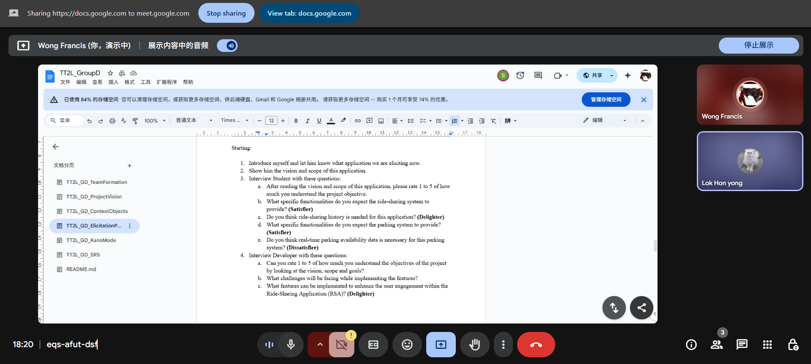

Figure 3.8.1 Screenshot of Francis Wong Wei Hou interviewing

#### 3.8.2 Observation Summary

Based on the elicitation plan

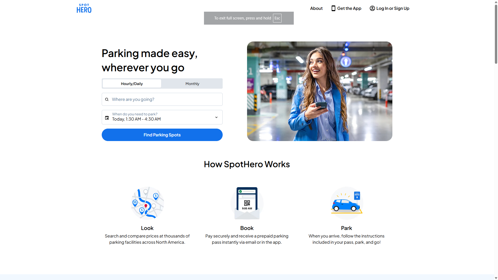

Figure 3.8.2 Screenshot of SpotHero Website

1.  **Overview**

This observation was conducted to evaluate the interface and features of
a competitor parking reservation platform — SpotHero. The goal was to
identify potential dissatisfiers in the design and functionality that,
if addressed properly, can improve the user experience of our own Campus
Ride-Sharing and Parking Integration System. This analysis focused on
usability, convenience, data presentation, and the efficiency of key
workflows.

2.  **User Interface Design**

**Navigation & Layout:**

SpotHero’s homepage is professionally designed, with a minimalist layout
and clear navigation. Users can easily search for parking spots based on
location and time. However, for first-time users, the absence of
step-by-step guidance or onboarding may be disorienting. In our system,
adding guided user tours or instructional overlays can help new users
navigate more confidently. Also, offering campus-specific navigation
categories (e.g., by faculty, block, or building) can better serve the
university context.

**Data Visualization:**

Parking availability is shown through a mix of map-based views and list
results, which is effective. However, the lack of interactive heat maps,
capacity color indicators, or zone congestion metrics may limit quick
comprehension during peak hours. For our platform, we could introduce
dynamic zone indicators (e.g., red/yellow/green areas) to represent
parking density more intuitively.

**Responsiveness:**

The website adapts well to different screen sizes and devices. However,
for users on slower connections or older devices, some features like map
zooming can lag slightly. Our system can prioritize lightweight map
layers and preloaded common locations to enhance mobile performance
on-campus.

3.  **Functionality**

**Parking Search & Reservation:**

The core functionality—searching and reserving parking—is
straightforward and effective. Filters like time, location, and price
are useful. However, it lacks support for academic zone-specific
searches, which would be more relevant in a university environment. In
our system, filtering based on building proximity, faculty zone, or
event-based parking could offer better utility.

**Authentication & Access Control:**

SpotHero uses standard email/password login, which is fine for public
users. However, it lacks role-based access or institutional
authentication. Our system will leverage university credential login
(SSO), enabling secure role-specific access for students, staff, and
administrators, ensuring proper system governance.

**Calendar & Reminders:**

There’s no built-in event or class calendar linking feature in SpotHero.
In contrast, integrating university timetables, parking reservations,
and ride schedules within a centralized calendar module will
significantly enhance convenience in our platform. Adding automated
reminders for bookings is also highly recommended.

4.  **Performance Indicators**

**Availability Indicators:**

SpotHero displays real-time availability of parking spots, which is a
strong feature. However, it does not include historical data trends or
forecast-based availability. For our project, introducing parking trend
analytics (e.g., full capacity hours, peak times) and usage-based
suggestions would aid decision-making for users and administrators
alike.

**Ride-Sharing Integration:**

SpotHero focuses solely on parking, with no ride-sharing functionality.
Our platform’s unique offering lies in integrating carpool coordination
and parking. Observing this gap reinforces the value of driver-passenger
matching, estimated travel time, and eco-score tracking as features that
can set us apart.

**Safety & Incident Reporting:**

There is no built-in incident or reporting mechanism. In a campus
setting, trust and safety are crucial. Our system should include
features such as in-ride SOS, ride history tracking, report buttons, and
trusted user badges to address this concern.

5.  **Recommendations**

|  |  |
|----|----|
| Area | Recommendation |
| Custom Campus Filters | Implement parking search by building name, faculty zone, or event |
| User Authentication | Replace public login with secure university SSO login |
| Ride-Sharing Coordination | Introduce carpool matching with driver-passenger preferences |
| Data Analytics | Use usage heatmaps, trend graphs and admin reports to optimize planning |

**b. Prototyping**

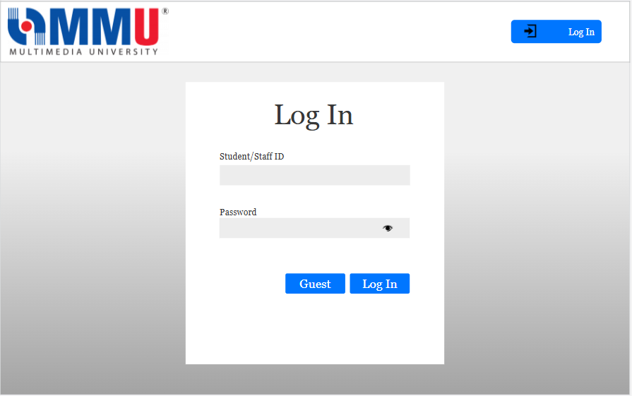

Figure 3.8.3 Screenshot of Prototype Log In Page

This is the login page where both student and staff may log in using
their ID and Password, where as guest can press the guest button to log
in. As for the admin, they can insert their ID and Password into the
same log in page but will be brought over a admin specific dashboard
which is not accessible to staff, student and guests.

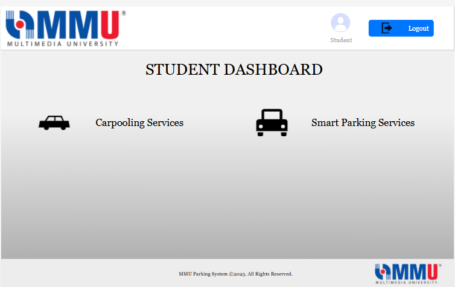

Figure 3.8.4 Screenshot of Prototype Student Dashboard

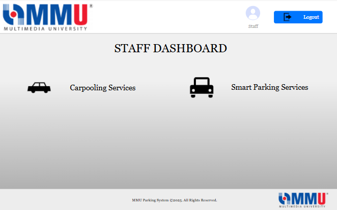

Figure 3.8.5 Screenshot of Prototype Staff Dashboard

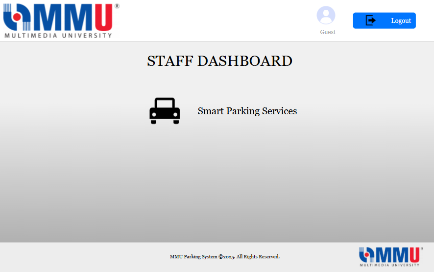

Figure 3.8.6 Screenshot of Prototype Guest Dashboard

These are the dashboard page for both the staff and student, where they
can access both carpooling and the smart parking services. Whereas for
guests, they can only access the smart parking service in their
dashboard.

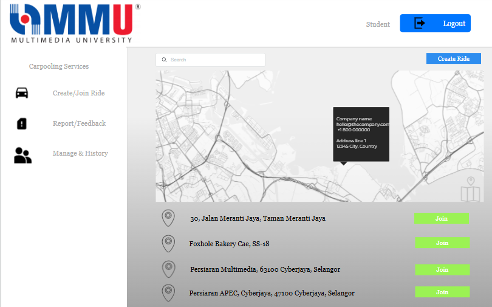

Figure 3.8.7 Screenshot of Prototype Student Carpooling services

Figure 3.8.8 Screenshot of Prototype Staff Carpooling services

This is the page that both staff and student will be brought to when
they press on the carpooling services button. In this page you will see
that there is a create&join ride section where they can either create a
ride and set their destination for others to see or they can join a ride
to the destination in common.

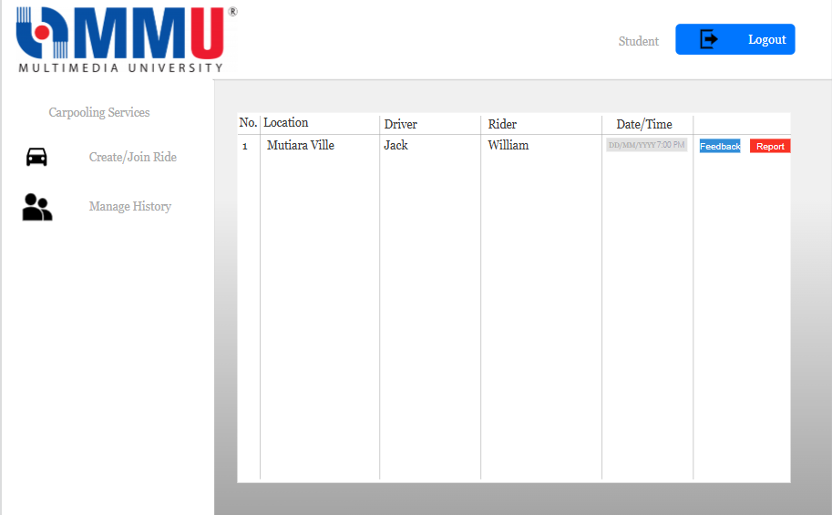

Figure 3.8.9 Screenshot of Prototype Student Carpooling Manage History

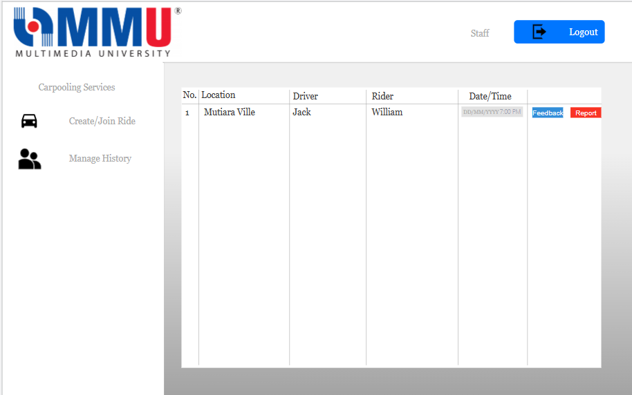

*Figure 3.8.10 Screenshot of Prototype Staff Carpooling Manage History*

This is the page where both student and staff are able to see their
carpooling history and also for them to be able to give feedback or
report on that particular drive.

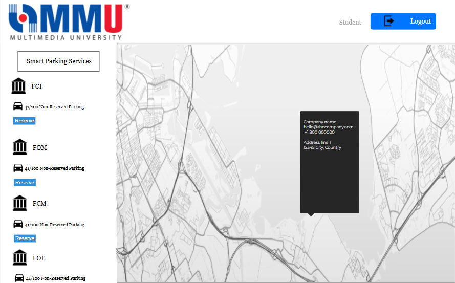

Figure 3.8.11 Screenshot of Prototype Student Smart Parking Services

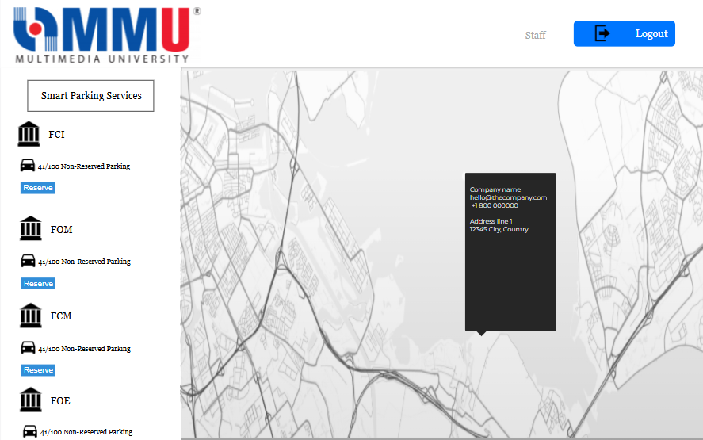

Figure 3.8.12 Screenshot of Prototype Staff Smart Parking Services

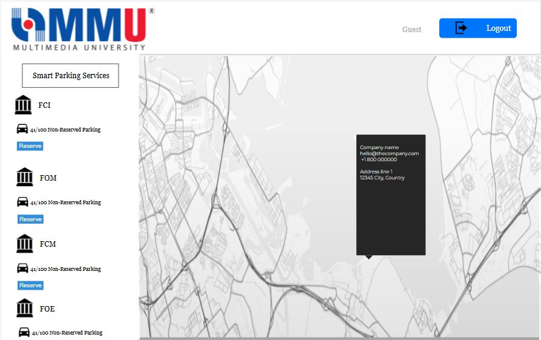

Figure 3.8.13 Screenshot of Prototype Guest Smart Parking Services

This page is for both students, staffs and guests alike to access the
smart parking services where they can see which faculty has how many
parkings left and decide if they want to reserve or not.

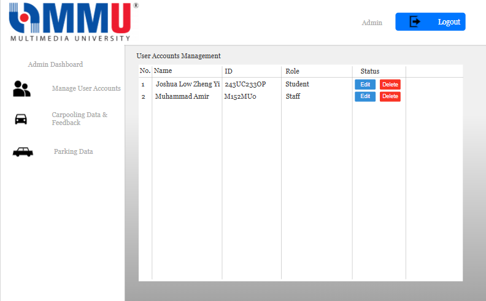

Figure 3.8.14 Screenshot of Prototype Admin Manage User Accounts

This the page where Admins can access and manage all user accounts for
both student and staff. They can both edit the information within the
account of both student and staff or delete the account in its entirety.

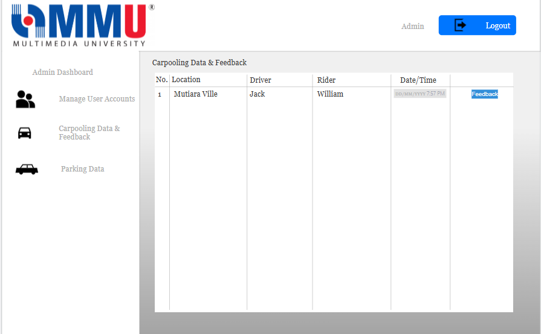

Figure 3.8.15 Screenshot of Prototype Admin Manage User Accounts

This is the page where Admins can view all the carpooling data and
feedbacks from the driver and rider.

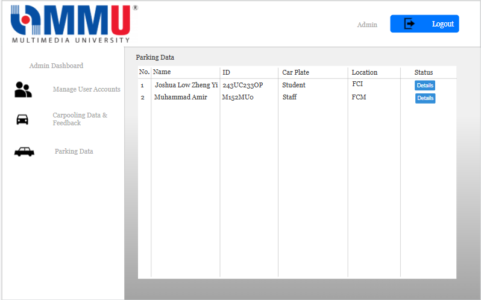

Figure 3.8.16 Screenshot of Prototype Admin Manage User Accounts

This is the page where Admins can view all the parking data which were
made reserved by who and at which faculty. Admin can choose to delete
the reserved parking data as they see fit.

## 4 Verification

### 4.1 Verification Approach

This section provides the verification approaches and methods planned to
qualify the software of the Ride-Sharing Platform with Parking System
Integration. The verification actions are organized in parallel with the
functional requirements, performance requirements, security
requirements, usability requirements, maintainability requirements, and
portability requirements. Each action includes details on how, who,
when, and where.

#### 4.1.1 Functional
Requirements Verification

Table 4.1: Functional Requirements Verification

<table>
<colgroup>
<col style="width: 18%" />
<col style="width: 19%" />
<col style="width: 19%" />
<col style="width: 23%" />
<col style="width: 19%" />
</colgroup>
<tbody>
<tr>
<td>Requirement ID</td>
<td>Method</td>
<td>Responsibility</td>
<td>Event-based Timing</td>
<td>
Venue/

Environment
</td>
</tr>
<tr>
<td>REQ_V001</td>
<td>Unit Testing</td>
<td>Developers</td>
<td>During implementation phase</td>
<td>Developer Environment / IDE</td>
</tr>
<tr>
<td>REQ_V002</td>
<td>System Integration Testing</td>
<td>QA Team</td>
<td>After integrating system modules</td>
<td>Testing Lab</td>
</tr>
</tbody>
</table>

#### 4.1.2 Performance
Requirements Verification

Table 4.2: Performance Requirements Verification
<table>
<colgroup>
<col style="width: 18%" />
<col style="width: 19%" />
<col style="width: 19%" />
<col style="width: 23%" />
<col style="width: 19%" />
</colgroup>
<tbody>
<tr>
<td>Requirement ID</td>
<td>Method</td>
<td>Responsibility</td>
<td>Event-based Timing</td>
<td>
Venue/

Environment
</td>
</tr>
<tr>
<td>REQ_V003</td>
<td>Load Testing</td>
<td>QA Team</td>
<td>After system completion</td>
<td>Performance Testing Tools</td>
</tr>
<tr>
<td>REQ_V004</td>
<td>Stress Testing</td>
<td>QA Engineers</td>
<td>Before deployment under peak load scenarios</td>
<td>Performance Lab</td>
</tr>
</tbody>
</table>

4.1.3 Security Requirements Verification

Table 4.3: Security Requirements Verification
<table>
<colgroup>
<col style="width: 18%" />
<col style="width: 19%" />
<col style="width: 19%" />
<col style="width: 23%" />
<col style="width: 19%" />
</colgroup>
<tbody>
<tr>
<td>Requirement ID</td>
<td>Method</td>
<td>Responsibility</td>
<td>Event-based Timing</td>
<td>
Venue/

Environment
</td>
</tr>
<tr>
<td>REQ_V005</td>
<td>Authentication Testing</td>
<td>Security Analyst, QA</td>
<td>After login &amp; role-based access are implemented</td>
<td>Secure Testing Environment</td>
</tr>
<tr>
<td>REQ_V006</td>
<td>Vulnerability Scanning</td>
<td>Security Team</td>
<td>Before production release</td>
<td>Security Testing Tools / Cloud Lab</td>
</tr>
</tbody>
</table>

#### 4.1.4 Usability
Requirements Verification

Table 4.4: Usability Requirements Verification
<table>
<colgroup>
<col style="width: 18%" />
<col style="width: 19%" />
<col style="width: 19%" />
<col style="width: 23%" />
<col style="width: 19%" />
</colgroup>
<tbody>
<tr>
<td>Requirement ID</td>
<td>Method</td>
<td>Responsibility</td>
<td>Event-based Timing</td>
<td>
Venue/

Environment
</td>
</tr>
<tr>
<td>REQ_V007</td>
<td>User Interface Evaluation</td>
<td>UX Designers, End Users</td>
<td>After prototype or beta version development</td>
<td>Usability Lab</td>
</tr>
<tr>
<td>REQ_V008</td>
<td>User Feedback Session</td>
<td>UX Team</td>
<td>During user testing or pilot launch</td>
<td>Online Surveys / Interview Session</td>
</tr>
</tbody>
</table>

#### 4.1.5 Maintainability
Requirements Verification

Table 4.5: Maintainability Requirements Verification
<table>
<colgroup>
<col style="width: 18%" />
<col style="width: 19%" />
<col style="width: 19%" />
<col style="width: 23%" />
<col style="width: 19%" />
</colgroup>
<tbody>
<tr>
<td>Requirement ID</td>
<td>Method</td>
<td>Responsibility</td>
<td>Event-based Timing</td>
<td>
Venue/

Environment
</td>
</tr>
<tr>
<td>REQ_V009</td>
<td>Code Review</td>
<td>Development Team Lead</td>
<td>After each development sprint</td>
<td>Code Repository / Review Tools</td>
</tr>
<tr>
<td>REQ_V010</td>
<td>Design Documentation Review</td>
<td>Developers, Analysts</td>
<td>During design validation meetings</td>
<td>Meeting Room / Online Documentation</td>
</tr>
</tbody>
</table>

#### 4.1.6 Portability
Requirements Verification

Table 4.6: Portability Requirements Verification
<table>
<colgroup>
<col style="width: 18%" />
<col style="width: 19%" />
<col style="width: 19%" />
<col style="width: 23%" />
<col style="width: 19%" />
</colgroup>
<tbody>
<tr>
<td>Requirement ID</td>
<td>Method</td>
<td>Responsibility</td>
<td>Event-based Timing</td>
<td>
Venue/

Environment
</td>
</tr>
<tr>
<td>REQ_V011</td>
<td>Cross-Platform Testing</td>
<td>QA Engineers</td>
<td>Before deploying to multiple OS/devices</td>
<td>Device Lab / Emulator Tools</td>
</tr>
<tr>
<td>REQ_V012</td>
<td>Browser Compatibility Testing</td>
<td>QA Team</td>
<td>During front-end testing phase</td>
<td>BrowserStack / Cloud Tools</td>
</tr>
</tbody>
</table>

4.2 Verification Criteria

This section shows that the system will be verified based on the
following criteria to ensure it meets the defined functional and quality
requirements:

Table 4.7: Verification Criteria
|  |  |  |
|:---|:---|:---|
| Requirement ID | Requirement/Feature | Verification Criteria |
| REQ_VC001 | Ride offer creation | The system shall allow a user to create a ride offer with details like origin, destination, time, and available seats. A successful message is displayed upon valid submission. |
| REQ_VC002 | Route matching | When a user searches for a trip, the system must display matched ride offers within a 5 km radius of the user's specified route. |
| REQ_VC003 | Parking reservation | A user must be able to reserve a parking spot only if it is marked as available in the system. |
| REQ_VC004 | View parking availability | The system must update and display current parking spot status in real-time. |
| REQ_VC005 | Report submission | Users must be able to submit an report while in an active ride, and the system shall record the report linked to the ride ID. |
| REQ_VC006 | User authentication | Login attempts with correct credentials must be authenticated, and users should be redirected based on their roles. |
| REQ_VC007 | Access control | Guests can access only parking-related features; they must not be allowed to view or create ride-sharing offers. |
| REQ_VC008 | Performance | The system shall return search results for ride offers or parking availability within 3 seconds under normal load. |
| REQ_VC009 | Usability | All primary actions (view parking availability, reserve parking, search ride, join ride, report) must be accessible within 3 clicks from the dashboard. |
| REQ_VC010 | Data Integrity | A ride offer must not be created without mandatory fields such as origin, destination, time, and seat count. |

## 5 Appendices

### 5.1 Assumptions and
Dependencies

**Assumptions**:

- Users (students and staff) have access to a stable internet connection
  when using the system.

- Users are familiar with basic web applications and can navigate the
  system without extensive training.

- The system will be accessed primarily via modern desktop or mobile web
  browsers.

- All registered university users have valid credentials stored in the
  university authentication system.

- Campus facilities such as parking lots have IoT sensors or manual
  updates to provide real-time parking data.

**Dependencies**:

- The system depends on the university's authentication server for
  verifying student and staff logins.

- Real-time parking data depends on integration with campus parking
  management infrastructure or sensors.

- Accurate GPS functionality depends on the device's built-in location
  services and browser support.

- Reporting functionality may rely on integration with campus security
  systems or alert services.

- Continuous server uptime and hosting infrastructure are required to
  ensure uninterrupted system access.

- System updates and maintenance depend on cooperation from university
  IT departments.

### 5.2 Acronyms and
Abbreviations

Table 5.1
|                        |                                                    |
|------------------------|----------------------------------------------------|
| Acronym / Abbreviation | Definition                                         |
| CRPIS                  | Campus Ride-Sharing and Parking Integration System |
| UI                     | User Interface                                     |
| UX                     | User Experience                                    |
| GPS                    | Global Positioning System                          |
| DB                     | Database                                           |
| API                    | Application Programming Interface                  |
| OTP                    | One-Time Password                                  |
| SSO                    | Single Sign-On                                     |
| HTTPS                  | Hypertext Transfer Protocol Secure                 |
| RTD                    | Real-Time Parking Data                             |
| ERF                    | Reporting Feature                                  |
| ASD                    | Authentication Server                              |
| SD                     | System Dashboard                                   |

